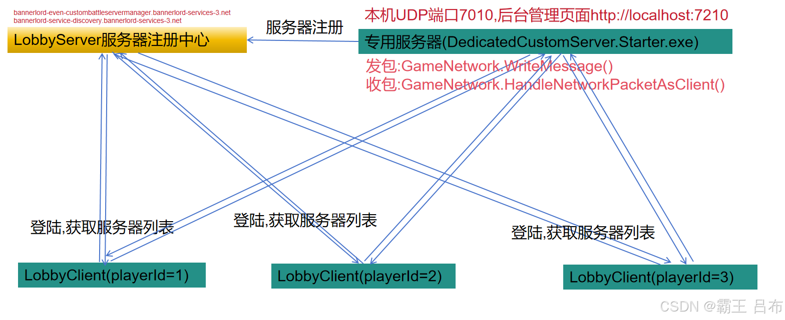
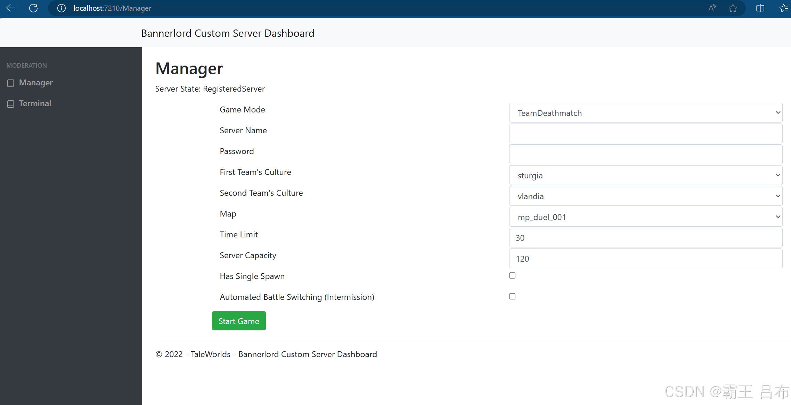

# 骑砍2霸主MOD开发(14)-多人联机模式开发环境搭建

> 来源: https://blog.csdn.net/qq_35829452/article/details/140600717
> 专栏: [骑砍Ⅱ霸主MOD开发教程](https://blog.csdn.net/qq_35829452/category_12538930.html)

---

                    一.多人联机模式网络拓扑图

 二.专用服务器搭建(DedicatedServer)

     <1.Token生成(用于LobbyServer的校验):

           进入多人联机大厅,ALT+~打开RGL控制台,输入customserver.gettoken

           Token文件路径:C:\Users\taohu\Documents\Mount and Blade II Bannerlord\Tokens

    <2.启动专用服务器(必须有公网IP和开放端口号7210):

         运行DedicatedCustomServer.Starter.exe

         服务器控制台命令(控制台输入list查看所有命令):

             Mount & Blade II Dedicated Server\Modules\Native\ds_config_sample_battle.txt

             Mount & Blade II Dedicated Server\Modules\Native\ds_config_sample_duel.txt

         服务器后台管理系统:

             http://localhost:7210/

三.客户端服务器列表搜索&加入

    <1.LobbyServer服务器集群地址:

         https://bannerlord-even-custombattleservermanager.bannerlord-services-3.net

         https://bannerlord-service-discovery.bannerlord-services-3.net

    <2.LobbyClient请求专用服务器列表:

         List<GameServerEntry> list = LobbyClient.GetCustomGameServerList()

         GameServerEntry:

             CustomBattleId:专用服务器唯一GUID

             Address:专用服务器公网IP

             Port:专用服务器端口号

    <3.LobbyClient请求加入专用服务器:

         LobbyClient.RequestJoinCustomGame()

四.客户端&服务器通信

    <1.发包:

         GameNetwork.WriteMessage()    

    <2.收包:

         GameNetwork.HandleNetworkPacketAsClient()

五.自定义联机-HTTP协议联机

     发起Http请求:HttpClient.PostAsync(string requestUri, HttpContent content)

六.自定义联机-TCP协议联机

     发起TCP连接请求:TcpSocket.Connect(string address, int port)

六.自定义联机-UDP协议联机

     UDP发包:UdpClient.send()

     UDP收包:UdpClient.receive()

                
