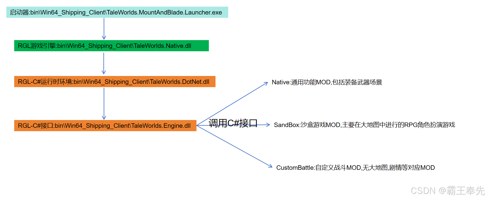
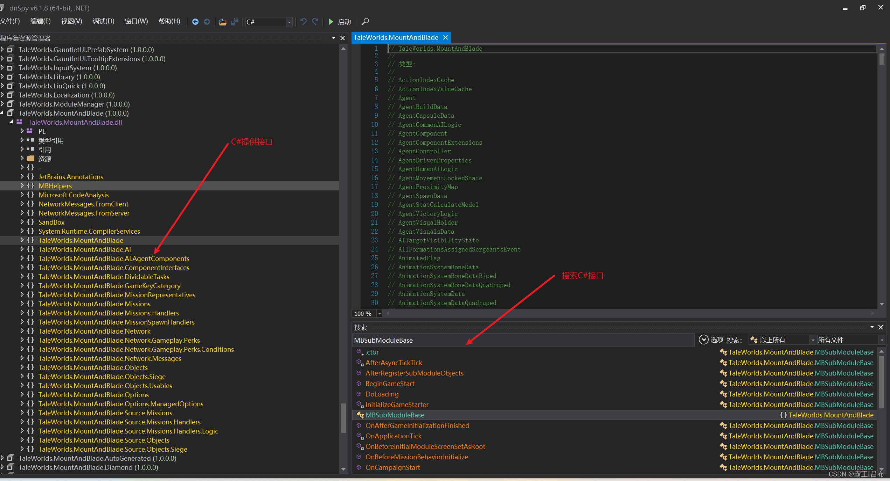
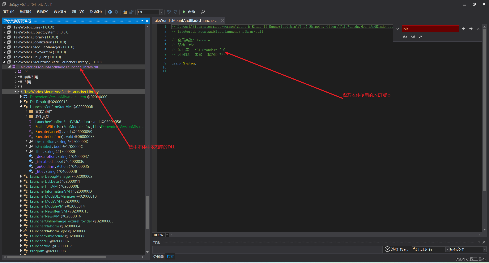
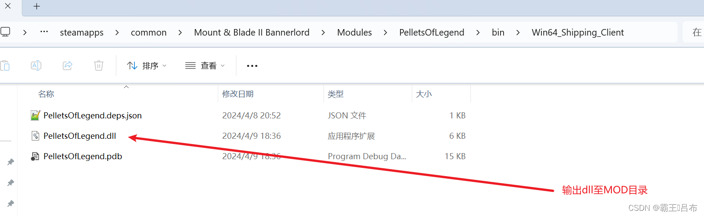

# 骑砍2霸主MOD开发(2)-基础开发环境搭建

> 来源: https://blog.csdn.net/qq_35829452/article/details/137564043
> 专栏: [骑砍Ⅱ霸主MOD开发教程](https://blog.csdn.net/qq_35829452/category_12538930.html)

---

                    一.引擎架构 
 
二.开发工具 
    1.dnspy:C#代码查看工具 
       <1.查看&搜索代码:添加Taleworlds*.dll至dnspy中可 
 
        <2.查看dll对应版本 
 
    2.VisualStudio:创建C#工程 
三.创建C#工程 
     1.VisualStudio下载并创建csproj配置文件: 
<Project Sdk="Microsoft.NET.Sdk">

  <PropertyGroup>
    <Version>0.0.1</Version>

    <!--指定VS编译依赖.net2框架, 与本体保持一致-->
	<TargetFramework>netstandard2.0</TargetFramework>
	<Platforms>x64</Platforms>

    <!--指定游戏安装目录-->
    <GameFolder>D:\work\Steam\steamapps\common\Mount &amp; Blade II Bannerlord</GameFolder>
    <GameBinariesFolder Condition="Exists('$(GameFolder)\bin\Win64_Shipping_Client\Bannerlord.exe')">Win64_Shipping_Client</GameBinariesFolder>
    <GameBinariesFolder Condition="Exists('$(GameFolder)\bin\Gaming.Desktop.x64_Shipping_Client\Bannerlord.exe')">Gaming.Desktop.x64_Shipping_Client</GameBinariesFolder>

    <!--指定输出dll名称,输出dll路径-->
	<AppendTargetFrameworkToOutputPath>false</AppendTargetFrameworkToOutputPath>
	<AppendRuntimeIdentifierToOutputPath>false</AppendRuntimeIdentifierToOutputPath>
	<AssemblyName>NativeTest</AssemblyName>
	<OutputPath>D:\work\Steam\steamapps\common\Mount &amp; Blade II Bannerlord\Modules\NativeTest\bin\Win64_Shipping_Client</OutputPath>
  </PropertyGroup>

  <!--指定使用C#接口-->
  <ItemGroup>
    <Reference Include="$(GameFolder)\bin\$(GameBinariesFolder)\Newtonsoft.Json.dll">
      <HintPath>%(Identity)</HintPath>
      <Private>False</Private>
    </Reference>
    <Reference Include="$(GameFolder)\bin\$(GameBinariesFolder)\TaleWorlds.*.dll" Exclude="$(GameFolder)\bin\$(GameBinariesFolder)\TaleWorlds.Native.dll">
      <HintPath>%(Identity)</HintPath>
      <Private>False</Private>
    </Reference>
    <Reference Include="$(GameFolder)\Modules\Native\bin\$(GameBinariesFolder)\*.dll">
      <HintPath>%(Identity)</HintPath>
      <Private>False</Private>
      <!--选择是否输出到对应目录-->
      <!--<CopyToOutputDirectory>Never</CopyToOutputDirectory>-->
    </Reference>
    <Reference Include="$(GameFolder)\Modules\SandBox\bin\$(GameBinariesFolder)\*.dll">
      <HintPath>%(Identity)</HintPath>
      <Private>False</Private>
    </Reference>
    <Reference Include="$(GameFolder)\Modules\SandBoxCore\bin\$(GameBinariesFolder)\*.dll">
      <HintPath>%(Identity)</HintPath>
      <Private>False</Private>
    </Reference>
    <Reference Include="$(GameFolder)\Modules\StoryMode\bin\$(GameBinariesFolder)\*.dll">
      <HintPath>%(Identity)</HintPath>
      <Private>False</Private>
    </Reference>
    <Reference Include="$(GameFolder)\Modules\CustomBattle\bin\$(GameBinariesFolder)\*.dll">
      <HintPath>%(Identity)</HintPath>
      <Private>False</Private>
    </Reference>
    <Reference Include="$(GameFolder)\Modules\BirthAndDeath\bin\$(GameBinariesFolder)\*.dll">
      <HintPath>%(Identity)</HintPath>
      <Private>False</Private>
    </Reference>
  </ItemGroup>
</Project> 
     2.创建主程序文件NativeTest.cs 
using System;
using System.Diagnostics;
using System.IO;
using System.Runtime.InteropServices;
using TaleWorlds.Core;
using TaleWorlds.Engine;
using TaleWorlds.InputSystem;
using TaleWorlds.Library;
using TaleWorlds.MountAndBlade;
using TaleWorlds.MountAndBlade.Source.Missions.Handlers;

namespace NativeTest
{
    public class NativeTest : MBSubModuleBase
    {
        <!--调用windows弹框MessageBox-->
        [DllImport("user32.dll", EntryPoint = "MessageBoxA")]
        public static extern int MsgBox(int hWnd, string msg, string caption, int type);

        protected override void OnSubModuleLoad()
        {
            base.OnSubModuleLoad();
            MsgBox(0, "OnSubModuleLoad", "msg box", 0x30);
        }

        public override void OnGameLoaded(Game game, object initializerObject)
        {
            base.OnGameLoaded(game, initializerObject);
            MsgBox(0, "OnGameLoaded", "msg box", 0x30);
        }

        public override void OnNewGameCreated(Game game, object initializerObject)
        {
            base.OnNewGameCreated(game, initializerObject);
            MsgBox(0, "OnNewGameCreated", "msg box", 0x30);
        }

        public override void OnBeforeMissionBehaviorInitialize(Mission mission)
        {
            base.OnBeforeMissionBehaviorInitialize(mission);
            try
            {
                var val = 0;
                var rst = 8 / val;
                throw new Exception("Dummy exception for stack trace");
                InformationManager.DisplayMessage(new InformationMessage("on mission behavior initialize"));
                mission.AddMissionBehavior(new FlyMissionTimer());
            }
            catch (Exception ex)
            {
                string stackTrace = new StackTrace(ex, true).ToString();
                File.AppendAllLines("../../Modules/NativeTest/crash_log.txt", new string[] {ex.ToString(), ex.Message, ex.StackTrace});
            }
        }
    } 
     3.点击生成/生成解决方案后编译cs文件为dll,根据csproj文件路径输出至MOD对应目录 
 
四.创建MOD文件夹 
    1.NativeTest\SubModule.xml 
<?xml version="1.0" encoding="utf-8"?>
<Module>
  <!--对应MOD启动器下显示MOD的版本和名称-->
  <Id value = "NativeTest"/>
  <Name value = "NativeTest"/>
  <Version value = "v1.2.9.36960"/>
  <DependedModules>
	<DependedModule Id="Native" DependentVersion="v1.2.9" Optional="false"/>
	<DependedModule Id="SandBoxCore" DependentVersion="v1.2.9" Optional="false"/>
  </DependedModules>

  <!--对应module_data下武器装备,军团属性的xml文件-->
  <Xmls>
	<XmlNode>                
		<XmlName id="Items" path="items"/>
		<IncludedGameTypes>
			<GameType value = "Campaign"/>
			<GameType value = "CampaignStoryMode"/>
			<GameType value = "CustomGame"/>
			<GameType value = "EditorGame"/>
		</IncludedGameTypes>
	</XmlNode>
  </Xmls>

  <!--对应bin\Win64_Shipping_Client下的MOD自定义DLL-->
  <SubModules>
	<SubModule>
      <Name value="NativeTestSubModule" />
      <DLLName value="NativeTest.dll" />
      <SubModuleClassType value="NativeTest.NativeTest" />		
	  <Tags>
		<Tag key="DedicatedServerType" value ="none" />
	  </Tags>
      <!-- 是否依赖其他自定义功能的库,若将工程编译为多个dll,需要进行加载 -->
      <Assemblies>
      </Assemblies>
	</SubModule>
  </SubModules>
</Module> 
    2.NativeTest\ModuleData\project.mbproj,配置声音,骨骼动画等相关配置文件路径. 
<?xml version="1.0" encoding="utf-8"?>
<base xmlns:xsi="http://www.w3.org/2001/XMLSchema-instance" xmlns:xsd="http://www.w3.org/2001/XMLSchema" type="solution">
  <outputDirectory>../MBModule/MBModule/</outputDirectory>
  <XMLDirectory>../WOTS/Modules/NativeTest/</XMLDirectory>
  <ModuleAssemblyDirectory>../WOTS/bin/</ModuleAssemblyDirectory>
  <file id="soln_module_sound" name="ModuleData/module_sounds.xml" type="module_sound" />
</base> 
五.游戏事件 
    在游戏中大地图行走,游戏场景进入&退出,人物Agent初始化等系统回调统称为游戏事件,分为大地图事件&任务事件。 
    1.任务事件MissionBehavior 
       进入酒馆/野外战斗/进入城堡等发生的AgentSpawn,AgentRemove,BeforeMissionStart等统称为MissionBehavior。 
   <1.在MBSubModuleBase中重写OnBeforeMissionBehaviorInitialize(Mission mission) 
   <2.获取Mission添加MyMissionBehavior事件捕捉 
   <3.实现MyMissionBehavior继承MissionBehavior重写OnAgentSpawn,OnMissionTick等回调 
public override void OnMissionBehaviorInitialize(Mission mission)
{
    base.OnMissionBehaviorInitialize(mission);
    mission.AddMissionBehavior(new MyMissionBehavior(mission));
}
 
public class MyMissionBehavior : BasicMissionHandler
{
    public override void OnAgentCreated(Agent agent)
    {
        base.OnAgentCreated(agent);
    }
 
    public override void OnMissionTick(float dt)
    {
    }
} 
    2.大地图事件CampaignBehavior 
    <1.在MBSubModuleBase中重写OnGameStart(Game game, IGameStarter gameStarterObject) 
    <2.在CampaignGameStarter中添加MyCampaignBehavior 
    <3.MyCampaignBehavior继承CampaignBehavior重写RegisterEvents,捕捉大地图事件 
protected override void OnGameStart(Game game, IGameStarter gameStarterObject)
{
    base.OnGameStart(game, gameStarterObject);
    if (gameStarterObject is CampaignGameStarter)
    {
       CampaignGameStarter starter = (CampaignGameStarter)gameStarterObject;
       starter.AddBehavior(new MyCampaignBehavior());
    }
}
 
public class MyCampaignBehavior : CampaignBehaviorBase {
 
    public override void RegisterEvents()
    {
        CampaignEvents.OnMainPartyStarvingEvent.AddNonSerializedListener(this, PlayMusic);
        CampaignEvents.DailyTickEvent.AddNonSerializedListener(this, PlayMusic);
    }
 
    public void PlayMusic()
    {
       MBMusicManager.Current.StartTheme(MusicTheme.MainTheme, 10, false);
       #添加装备
       ItemObject itemObject = MBObjectManager
           .Instance.GetObject<ItemObject>("guarded_padded_vambrace");
       MobileParty.MainParty.ItemRoster.AddToCounts(itemObject, 2);
       #修改技能点
       Hero playerHero = MobileParty.MainParty.LeaderHero;
       foreach (SkillObject skill in Skills.All)
       {
          InformationManager.DisplayMessage(new InformationMessage(string.Format("skill id {0}, name{1}", skill.Id, skill.Name)));
          if (skill.StringId == "Bow")
          {
             playerHero.SetSkillValue(skill, 5);
          }
       }
       
       #添加troop
       CharacterObject characterObject = 
          MBObjectManager.Instance.
          GetObject<CharacterObject>("vlandian_vanguard");
       MobileParty.MainParty.MemberRoster.AddToCounts(characterObject, 20);
    }
 
 
    public override void SyncData(IDataStore dataStore)
    {
 
    }
}
                
