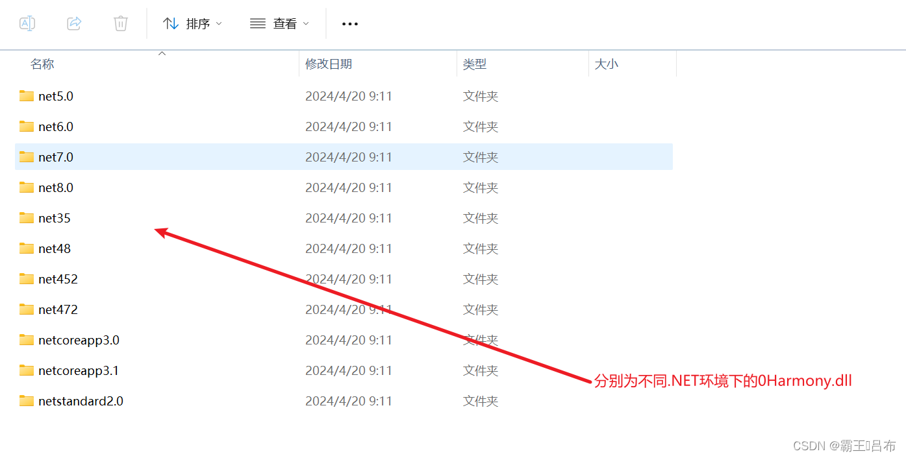
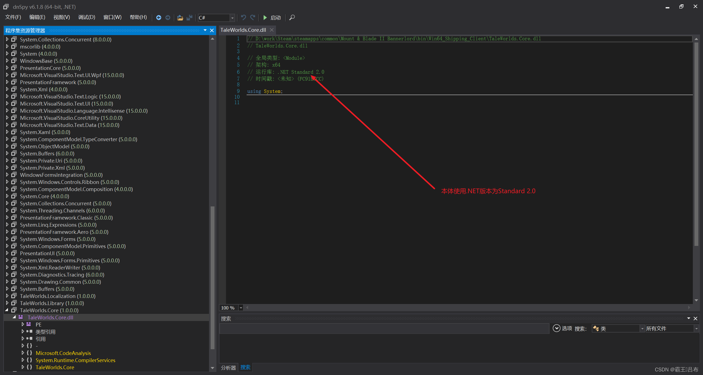

# 骑砍2霸主MOD开发(6)-使用C#-Harmony修改本体游戏逻辑

> 来源: https://blog.csdn.net/qq_35829452/article/details/138039550
> 专栏: [骑砍Ⅱ霸主MOD开发教程](https://blog.csdn.net/qq_35829452/category_12538930.html)

---

                    一.C#-Harmony反射及动态注入 
    利用C#运行时环境的反射原理,实现对已加载DLL,未加载DLL中代码替换和前置后置插桩. 
    C#依赖库下载地址:霸王•吕布 / CSharpHarmonyLib · GitCodehttps://gitcode.net/qq_35829452/csharpharmonylib 
    根据实际运行.Net环境选择对应版本的0Harmony.dll 
 
二.csproj文件添加0Harmony.dll依赖 
    <1.使用dnspy确定当前游戏版本使用.NET运行时环境 
 
    <2.确定启动项为TaleWorlds.MountAndBlade.Launcher.exe 
    <3.csproj选择编译环境,依赖dll路径 
<Project Sdk="Microsoft.NET.Sdk">
 
  <PropertyGroup>
    <Version>0.0.1</Version>
 
    <!--指定VS编译依赖.net2框架-->
	<TargetFramework>netstandard2.0</TargetFramework>
	<Platforms>x64</Platforms>
 
    <!--指定游戏安装目录-->
    <GameFolder>D:\work\Steam\steamapps\common\Mount &amp; Blade II Bannerlord</GameFolder>
    <GameBinariesFolder Condition="Exists('$(GameFolder)\bin\Win64_Shipping_Client\Bannerlord.exe')">Win64_Shipping_Client</GameBinariesFolder>
    <GameBinariesFolder Condition="Exists('$(GameFolder)\bin\Gaming.Desktop.x64_Shipping_Client\Bannerlord.exe')">Gaming.Desktop.x64_Shipping_Client</GameBinariesFolder>
 
    <!--指定输出dll名称,输出dll路径-->
	<AppendTargetFrameworkToOutputPath>false</AppendTargetFrameworkToOutputPath>
	<AppendRuntimeIdentifierToOutputPath>false</AppendRuntimeIdentifierToOutputPath>
	<AssemblyName>NativeTest</AssemblyName>
	<OutputPath>D:\work\Steam\steamapps\common\Mount &amp; Blade II Bannerlord\Modules\NativeTest\bin\Win64_Shipping_Client</OutputPath>
  </PropertyGroup>
 
  <!--指定使用C#接口-->
  <ItemGroup>
    <Reference Include="$(GameFolder)\bin\$(GameBinariesFolder)\Newtonsoft.Json.dll">
      <HintPath>%(Identity)</HintPath>
      <Private>False</Private>
    </Reference>
    <Reference Include="$(GameFolder)\Modules\Harmony\bin\Win64_Shipping_Client\0Harmony.dll">
		<HintPath>%(Identity)</HintPath>
		<Private>False</Private>
    </Reference>
    <Reference Include="$(GameFolder)\bin\$(GameBinariesFolder)\TaleWorlds.*.dll" Exclude="$(GameFolder)\bin\$(GameBinariesFolder)\TaleWorlds.Native.dll">
      <HintPath>%(Identity)</HintPath>
      <Private>False</Private>
    </Reference>
    <Reference Include="$(GameFolder)\Modules\Native\bin\$(GameBinariesFolder)\*.dll">
      <HintPath>%(Identity)</HintPath>
      <Private>False</Private>
    </Reference>
    <Reference Include="$(GameFolder)\Modules\SandBox\bin\$(GameBinariesFolder)\*.dll">
      <HintPath>%(Identity)</HintPath>
      <Private>False</Private>
    </Reference>
    <Reference Include="$(GameFolder)\Modules\SandBoxCore\bin\$(GameBinariesFolder)\*.dll">
      <HintPath>%(Identity)</HintPath>
      <Private>False</Private>
    </Reference>
    <Reference Include="$(GameFolder)\Modules\StoryMode\bin\$(GameBinariesFolder)\*.dll">
      <HintPath>%(Identity)</HintPath>
      <Private>False</Private>
    </Reference>
    <Reference Include="$(GameFolder)\Modules\CustomBattle\bin\$(GameBinariesFolder)\*.dll">
      <HintPath>%(Identity)</HintPath>
      <Private>False</Private>
    </Reference>
    <Reference Include="$(GameFolder)\Modules\BirthAndDeath\bin\$(GameBinariesFolder)\*.dll">
      <HintPath>%(Identity)</HintPath>
      <Private>False</Private>
    </Reference>
  </ItemGroup>
</Project> 
三.SubModule.xml添加0Harmony.dll依赖 
  <!-- 对应bin\Win64_Shipping_Client下的MOD自定义DLL-->
  <SubModules>
	<SubModule>
      <Name value="NativeTestSubModule" />
      <DLLName value="NativeTest.dll" />
      <SubModuleClassType value="NativeTest.NativeTest" />
      <Assemblies>
        <Assembly value="0Harmony.dll" />
      </Assemblies>
	  <Tags>
		<Tag key="DedicatedServerType" value ="none" />
	  </Tags>
	</SubModule>
  </SubModules> 
四.Harmony实现对任意类任意方法的前置后置插桩 
    <1.MBSubModuleBase.OnSubModuleLoad()中进行Harmony注入 
    <2.实现Prefix,Postfix前置后置插桩,实现对本体代码的修改,例如游戏菜单的加载调用前插入一个对话框MsgBox 
public class NativeTest : MBSubModuleBase
{
      protected override void OnSubModuleLoad()
        {
            base.OnSubModuleLoad();
            Harmony patch = new Harmony("MyPatch");
            patch.PatchAll();
            PrefixbBox();
        }
}

#实现对游戏菜单初始化的前置插桩
namespace CampaignMissionPatch
{
    [HarmonyPatch(typeof(EncounterGameMenuBehavior), "AddGameMenus")]
    public class CampaignMissionPatch {

        [DllImport("user32.dll", EntryPoint = "MessageBoxA")]
        public static extern int MsgBox(int hWnd, string msg, string caption, int type);

        public static bool Prefix(CampaignGameStarter gameSystemInitializer)
        {
            MsgBox(0, "this is conversation mission", "msg box", 0x30);
            return true;
        }
    }
}

 
五.常用Harmony修改 
    1.修改野外战斗场景为指定场景 
    [HarmonyPatch(typeof(PlayerEncounter), "GetBattleSceneForMapPatch")]
    public class GetBattleSceneForMapPatch
    {
 
        [DllImport("user32.dll", EntryPoint = "MessageBoxA")]
        public static extern int MsgBox(int hWnd, string msg, string caption, int type);
 
        public static bool Prefix(ref string __result)
        {
            MsgBox(0, "GetBattleSceneForMapPatch prefix", "msg box", 0x30);
            __result = "p_song_battle_terrain_1";
            return false;
        }

        public static void Postfix(ref string __result)
        {
            MsgBox(0, __result, "msg box", 0x30);
        }
    } 
    2.去除战斗音乐 
  [HarmonyPatch(typeof(MusicBattleMissionView), "CheckForEnding")]
  public class CheckForEndingPatch
   {

      [DllImport("user32.dll", EntryPoint = "MessageBoxA")]
      public static extern int MsgBox(int hWnd, string msg, string caption, int type);

      public static bool Prefix()
      {
           return false;
      }
   }

   [HarmonyPatch(typeof(MusicBattleMissionView), "CheckForStarting")]
   public class CheckForStartingPatch
   {

       [DllImport("user32.dll", EntryPoint = "MessageBoxA")]
       public static extern int MsgBox(int hWnd, string msg, string caption, int type);

       public static bool Prefix()
       {
           return false;
       }
   }

   [HarmonyPatch(typeof(MusicBattleMissionView), "OnAgentRemoved")]
   public class OnAgentRemovedPatch
   {

       [DllImport("user32.dll", EntryPoint = "MessageBoxA")]
       public static extern int MsgBox(int hWnd, string msg, string caption, int type);

       public static bool Prefix()
       {
           return false;
       }
   } 
    3.覆写ModuleData中project.mbproj配置文件 
    [HarmonyPatch(typeof(MBObjectManager), "CreateMergedXmlFile")]
    public class MBObjectManagerPatch
    {

        [DllImport("user32.dll", EntryPoint = "MessageBoxA")]
        public static extern int MsgBox(int hWnd, string msg, string caption, int type);

        public static bool Prefix(ref List<Tuple<string, string>> toBeMerged, ref List<string> xsltList, ref bool skipValidation, ref object __result)
        {
            MethodInfo method = AccessTools.Method(typeof(MBObjectManager), "CreateDocumentFromXmlFile");
            XmlDocument xmlDocument = (XmlDocument)method.Invoke(null, new object[3] { toBeMerged[0].Item1, toBeMerged[0].Item2, skipValidation });
            for (int i = 1; i < toBeMerged.Count; i++)
            {
                if (xsltList[i] != "")
                {
                    xmlDocument = MBObjectManager.ApplyXslt(xsltList[i], xmlDocument);
                }
                if (toBeMerged[i].Item1 != "")
                {
                    XmlDocument xmlDocument2 = (XmlDocument)method.Invoke(null, new object[3] { toBeMerged[i].Item1, toBeMerged[i].Item2, skipValidation });
                    xmlDocument = MBObjectManager.MergeTwoXmls(xmlDocument2, xmlDocument);
                }
            }
            __result = xmlDocument;
            return false;
        }
    } 

                
