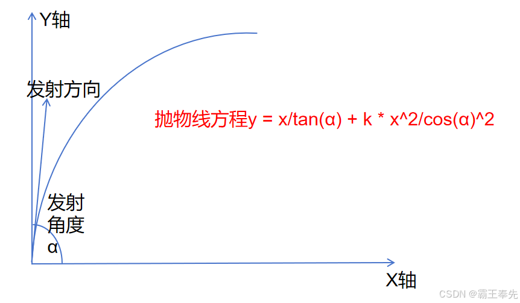

# 骑砍Ⅱ霸主MOD开发(24)-定制化GameEntity-Missile

> 来源: https://blog.csdn.net/qq_35829452/article/details/142754666
> 专栏: [骑砍Ⅱ霸主MOD开发教程](https://blog.csdn.net/qq_35829452/category_12538930.html)

---

                    一.Missile

    游戏中弩箭/弓箭/飞石/炮弹等在场景中沿抛物线飞行实例GameEntity即为Missile.Missile的发射,飞行,物理碰撞等都是定制化GameEntity实现。

二.Missile发射

    <1.获取MissionWeapon

ItemObject obj = Game.Current.ObjectManager.GetObject<ItemObject>("boulder");
MissionWeapon weapon = new MissionWeapon(obj, null, null, 1);

    <2.输入Missile参数(速度,发射方向)

Mission.AddMissileAux
int AddMissileAux(
    int forcedMissileIndex, 
    bool isPrediction, 
    Agent shooterAgent, 
    in WeaponData weaponData, //武器属性参数.重量,材质
    WeaponStatsData[] weaponStatsData, 
    float damageBonus, 
    ref Vec3 position, //发射点
    ref Vec3 direction, //发射方向
    ref Mat3 orientation, 
    float baseSpeed, //发射速度
    float speed, //发射速度
    bool addRigidBody, 
    GameEntity gameEntityToIgnore, 
    bool isPrimaryWeaponShot, 
    out GameEntity missileEntity //返回Missile对应GameEntity
)

三.Missile飞行

    <1.飞行抛物线方程

          Missile的飞行抛物线是二次曲线,Missile相对于发射点的X/Y轴偏移与角度关系如下。

          抛物线方程y = x/tan(α) + k * x^2/cos(α)^2

    <2.飞行抛物线常量k

          1.根据落地点确定发射角度α

Mission.GetMissileVerticalAimCorrection()

          2.根据落地点相对发射点相对坐标(X,Y)和α确定常量k

   <3.飞行时空气阻尼

         ModuleData/managed_core_parameters.xml进行配置

#空气阻尼与Item重量,Item类型有关
AirFriction = surfaceArea * FrictionCoefficient / mass

   <4.飞行时粒子系统(火箭,飞石)

         Weapon:trail_particle_name

   <5.飞行尾迹(弩矢尾部痕迹)

         WeaponFlag:LeavesTrail

四.Missile物理碰撞

    <1.物理碰撞检测

        <1.1 Mission.MissileHitCallback:

                Missile与场景中GameEntity发生碰撞后触发,命中人,命中可摧毁的物体触发

        <1.2 Mission.MissileAreaDamageCallback

               范围性伤害Missile命中地表时触发范围伤害,飞石,手雷等

    <2.碰撞结果处理

        不同Missile碰撞后可能会出现爆炸(燃油罐),附着(弩矢),消失(落水)等

        Mission.HandleMissileCollisionReaction

PhysicsMaterialFlags.DontStickMissiles 物理碰撞后Missile是否会发生附着
WeaponFlags.CanPenetrateShield 物理碰撞后Missile是否能击穿盾牌
MissileCollisionReaction.PassThrough 物理碰撞后Missile是否继续检测

                
