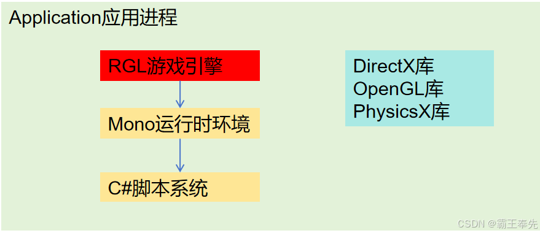

# 骑砍Ⅱ霸主MOD开发(26)-本体域&托管域&外部DLL库

> 来源: https://blog.csdn.net/qq_35829452/article/details/144724690
> 专栏: [骑砍Ⅱ霸主MOD开发教程](https://blog.csdn.net/qq_35829452/category_12538930.html)

---

                    一.启动流程

    <1.启动器Launcher

         运行TaleWorlds.MountAndBlade.Launcher.exe启动MOD列表Launcher页面.

public class Program
{
    public static void Main(string[] args)
    {
        #加载启动器GUI界面
		ResourceDepot resourceDepot = new ResourceDepot();
		resourceDepot.AddLocation(BasePath.Name, "Modules/Native/LauncherGUI/");
		resourceDepot.CollectResources();
		resourceDepot.StartWatchingChangesInDepot();

        #点击确定后拉起主进程
		if (Program._gameStarted)
		{
		    LauncherPlatform.SetLauncherMode(false);
			Program.Main(Program._args.ToArray());
		}
    }
}

    <2.Application主进程

         点击确定后,RGL引擎根据Platform平台(Steam/EPIC)拉起WOTS应用主进程,完成MONO运行时环境创建,系统资源加载.

public class Program
{
    [STAThread]
    public static int Main(string[] args)
	{
	    Thread.CurrentThread.CurrentCulture = CultureInfo.InvariantCulture;
		Thread.CurrentThread.CurrentUICulture = CultureInfo.InvariantCulture;
		CultureInfo.DefaultThreadCurrentCulture = CultureInfo.InvariantCulture;
		CultureInfo.DefaultThreadCurrentUICulture = CultureInfo.InvariantCulture;
		Program._args = args;
		return Program.Starter();
	}
}

二.本体域&托管域&外部DLL库

     应用进程:由Lanucher启动器启动的主进程,负责外部库的加载和RGL游戏引擎的拉起.

     本地域:C++实现RGL游戏引擎,完成GameEntity,Component等资源的管理.

     托管域:由Mono运行时环境管理的C#脚本系统,负责完成接口映射和C#对象创建&销毁.

     外部DLL库:OpenGL,DirectX等核心库,通过DLL动态链接装载至应用进程.

三.RGL引擎中的实例对象

    <1.NativeObject

         Camera,GameEntity,Scene等单例常驻内存对象即为NativeObject,对象的GC由RGL完成。

#UIntPtr即为本体对象指针
public class NativeObject
{
   public UIntPtr Pointer
}

#构造函数新增引用计数
IManaged.IncreaseReferenceCount

#构造函数新增引用计数
IManaged.DecreaseReferenceCount

     <2.DotNetObject

          Mission,Agent,ScriptComponentBehavior等频繁创建销毁对象即为DotNetObject,对象的GC由托管域实现。

#对象使用objectId进行维护
public class DotNetObject
{
	private readonly int _objectId;
}

#构造函数新增引用计数
GCHandle.Alloc()

#构造函数新增引用计数
GCHandle.Free()

四.C++调用C#接口

    通过MonoPInvokeCallback注解,Mono会扫描这些注解映射的方法,完成C++接口的映射.

    <1.LibraryCallbacksGenerated(C#实例的GC,创建,销毁)

		
internal static class LibraryCallbacksGenerated
{
[MonoPInvokeCallback(typeof(LibraryCallbacksGenerated.Managed_ApplicationTick_delegate))]
internal static void Managed_ApplicationTick(float dt)
{
	Managed.ApplicationTick(dt);
}
}

    <2.CoreCallbacksGenerated(OnAgentHit,OnMissileHit等游戏事件)

internal static class CoreCallbacksGenerated
{
[MonoPInvokeCallback(typeof(CoreCallbacksGenerated.Mission_OnAgentDeleted_delegate))]
internal static void Mission_OnAgentDeleted(int thisPointer, int affectedAgent)
{
	Mission mission = DotNetObject.GetManagedObjectWithId(thisPointer) as Mission;
	Agent affectedAgent2 = DotNetObject.GetManagedObjectWithId(affectedAgent) as Agent;
	mission.OnAgentDeleted(affectedAgent2);
}
}

五.C#调用C++接口

    <1.MonoNativeFunctionWrapperAttribute映射

internal class ScriptingInterfaceOfISceneView
{
    [UnmanagedFunctionPointer(CallingConvention.StdCall, CharSet = CharSet.Ansi)]
    [SuppressUnmanagedCodeSecurity]
    [MonoNativeFunctionWrapper]
    [return: MarshalAs(UnmanagedType.U1)]
    public delegate bool ReadyToRenderDelegate(UIntPtr pointer);
}

    <2.DllImport映射

internal static class MBDotNet
{
    [SuppressUnmanagedCodeSecurity]
    [DllImport("TaleWorlds.Native.dll", CallingConvention = CallingConvention.StdCall, EntryPoint = "WotsMainSDLL")]
    public static extern int WotsMainDotNet(string args);
}

                
