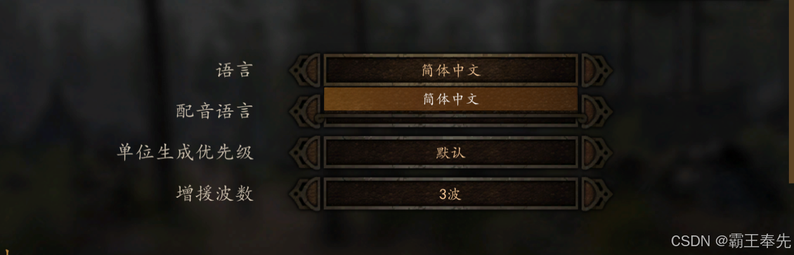

# 骑砍Ⅱ霸主MOD开发(3)-音乐&声音&语音&视频&语言&字体

> 来源: https://blog.csdn.net/qq_35829452/article/details/137773724
> 专栏: [骑砍Ⅱ霸主MOD开发教程](https://blog.csdn.net/qq_35829452/category_12538930.html)

---

                    一.音乐(music)

    1.创建MOD/Music, MOD/Music/PC文件夹,将需要的音乐文件OGG/WAV放置到该目录下.

    2.创建MOD/Music/soundtrack.xml配置文件,配置目标音乐.

PsaiProject->
    Theme
        -> Group
            -> Segment
                -> AudioData(ogg/wav声音文件)
Theme:
    id:Theme的唯一标识,与Segment的ThemeId关联
    ThemeTypeInt:播放标识,循环播放/单次播放/间断播放
Group:
    serialization_id:Group唯一标识
Segment:
    id:segment唯一id
    themeId:与对应Theme的ID关联
AudioData:
    Path:音乐文件名称
    TotalLengthInSamples: 音乐时长(s) * SampleRate

    3.加载soundtrack.xml

protected override void OnSubModuleLoad()
{
    base.OnSubModuleLoad();
    List<string> moduleNames = new List<string>() { PLModuleConfig.ModuleName };
    PsaiCore.Instance.LoadSoundtrackFromProjectFile(moduleNames);
}

    4.播放/停止音乐

public void PlayMusic(int musicId)
{
    PsaiCore.Instance.TriggerMusicTheme(musicId, 10);
}

public void StopMusic(int musicId)
{
    PsaiCore.Instance.StopMusic(true, 3f);
    PLHarmonyUtilities.InvokePrivateSetterMethod(
        MBMusicManager.Current, 
        "CurrentMode", 
        MusicMode.Paused);
}

    5.获取音乐播放状态

#播放完成 -1, 正在播放 > 0
public int GetPlayMusicId()
{
    return PsaiCore.Instance.GetCurrentThemeId();
}

#PsaiInfo.state返回音乐播放状况
public PsaiInfo GetPlayMusicInfo()
{
    return PsaiCore.Instance.GetPsaiInfo();
}

二.声音(sound)

   1.创建MOD/ModuleSounds文件夹,将ogg/wav文件放置在ModuleSounds目录下.

   2.在MOD/ModuleData目录下新增project.mbproj,module_sounds.xml配置文件.

      <1.project.mbproj文件配置内容:

<?xml version="1.0" encoding="utf-8"?>
<base xmlns:xsi="http://www.w3.org/2001/XMLSchema-instance" xmlns:xsd="http://www.w3.org/2001/XMLSchema" type="solution">
  <outputDirectory>../MBModule/MBModule/</outputDirectory>
  <XMLDirectory>../WOTS/Modules/NativeAssetsTest/</XMLDirectory>
  <ModuleAssemblyDirectory>../WOTS/bin/</ModuleAssemblyDirectory>
  <file id="soln_module_sound" name="ModuleData/module_sounds.xml" type="module_sound" />
</base>

      <2.module_sounds.xml文件配置内容:

#重要参数介绍
<1.sound_category:循环播放/单次播放标识符,播放优先级标识符
   循环播放的3D声音,燃烧的房子/火把: sound_category="mission_ambient_bed"
   循环播放的2D声音:sound_category="campaign_bed"
   单次播放的3D声音:sound_category="mission_combat"
   单次播放的2D声音:sound_category="ui"
<2.is_2d:2D/3D声音,3D声音随屏幕和声音的距离增大而衰减,2D声音保持不变

<3.pitch_multiplie:高低音效果加成

<4.min_distance:3D声音衰减距离阈值(最小值)

<5.max_distance:3D声音衰减距离阈值(最大值)

#范例
<1.循环播放的3D声音:
   <module_sound name="event:/pl/scene_prop/torch" 
        is_2d="false" 
        sound_category="mission_ambient_bed"
        path="torch.wav" />

<2.循环播放的2D声音:
   <module_sound name="event:/pl/scene_prop/airplane_engine" 
        is_2d="true" 
        sound_category="campaign_bed"
        path="airplane_engine.wav" />

<3.单次播放的3D声音:
   <module_sound name="event:/pl/scene_prop/shell_boom" 
        is_2d="false" 
        sound_category="mission_combat" 
        path="shell_boom.wav" />

<4.单次播放的2D声音:
	<module_sound name="event:/pl/voice/combat/high_cheer" 
        is_2d="true" 
        sound_category="ui" 
        path="high_cheer.ogg" />

   3.播放SoundEvent

      <1.设置Sound监听位置ListenerFrame

#设置监听点ListenderFrame
SoundManager.SetListenerFrame(listenderFrame);

      <2.创建SoundEvent实例

#加载本体Bank文件中的声音资源(Sounds\PC\*.bank)
string soundStr = "event:/map/ambient/node/settlements/2d/tavern"
SoundEvent sound = SoundEvent.CreateEventFromString(soundStr, null);

#加载MOD配置文件中module_sounds.xml中的声音资源
string soundStr = "event:/sound/test"
int soundIndex = SoundEvent.GetEventIdFromString(soundStr);
SoundEvent sound = SoundEvent.CreateEvent(soundIndex, Mission.Scene);

#加载音乐文件直接播放(旁白声道)
string soundPath = "/NativeTest/test.ogg"
SoundEvent sound = SoundEvent.CreateEventFromExternalFile("event:/Extra/voiceover", soundPath, Mission.Current.Scene);

      <3.播放2D-SoundEvent声音

SoundEvent sound = SoundEvent.CreateEvent(soundIndex, scene);
sound.Play();

      <4.播放3D-SoundEvent声音

#SoundEvent播放完毕后不释放,常用于循环播放的3D声音
SoundEvent sound = SoundEvent.CreateEvent(soundIndex, scene);
sound.PlayInPosition(position);

#SoundEvent播放完毕后释放(oneshot模式),常用于单次播放的3D声音
mission.MakeSound(soundIndex, position, false, true, -1, -1);

      <5.中断/接续-SoundEvent声音

#声音中断
SoundEvent.Pause()

#声音重新接续
SoundEvent.Resume()

      <6.释放SoundEvent资源

#手动引导释放
 SoundEvent.Release()

三.语音(voice)

    <1.在MOD/ModuleData目录下创建voice_definitions.xml配置文件.

#语音类型(映射为SkinVoiceMananger.VoiceType)
<voice_type_declarations>
</voice_type>

#语音声音(path映射至module_sounds.xml中的3D/2D声音)
<voice_definition name="male_01" sound_and_collision_info_class="human" only_for_npcs="true" min_pitch_multiplier="0.9" max_pitch_multiplier="1.1">
	<voice type="Grunt" path="event:/voice/combat/male/01/grunt" face_anim="grunt" />
</voice_definition>

    <2.在MOD/ModuleData目录下创建skin.xml配置文件.

#voice_type映射至语音类型
<skin>
    <voice_types>
    </voice_types>
</skin>

    <3.project.mbproj配置skin.xml,voice_definitions.xml,module_sound等路径.

<?xml version="1.0" encoding="utf-8"?>
<base xmlns:xsi="http://www.w3.org/2001/XMLSchema-instance" xmlns:xsd="http://www.w3.org/2001/XMLSchema" type="solution">
  <outputDirectory>../MBModule/MBModule/</outputDirectory>
  <XMLDirectory>../WOTS/Modules/NativeAssetsTest/</XMLDirectory>
  <ModuleAssemblyDirectory>../WOTS/bin/</ModuleAssemblyDirectory>
  <file id="soln_voice_definitions" name="ModuleData/voice_definitions.xml" type="voice_definitions" />
</base>

    <4.配置NPCCharacter确定语音类型(根据voice和age确定).

<NPCCharacter id="main_hero" default_group="Cavalry" is_hero="true" voice="earnest">
</NPCCharacter>

    <5.Agent播放语音

#游戏场景中播放
Agent.MakeVoice();

#2D播放
AgentVisual.MakeVoice();

四.视频(video) 

    <1.视频Video = ogg(声音)+ivf(视频)+srt(字幕).

         开机视频:Modules\Native\Videos\TWLogo_and_Partners.ivf

         战役开头视频:Modules\SandBox\Videos\CampaignIntro\campaign_intro_cs_1080p.ivf

         战役结束视频:Modules\SandBox\Videos\CampaignOutro\imperial_outro.ivf

    <2.播放Video:

#videoPath 为ivf绝对路径 audioPath为ogg绝对路径
VideoPlaybackState videoPlaybackState = GameStateManager.CreateState<VideoPlaybackState>();
videoPlaybackState.SetStartingParameters(videoPath, audioPath, "", 30f, true);
videoPlaybackState.SetOnVideoFinisedDelegate(delegate
{
    #视频播放完成后完成界面跳转,Mission创建等重要操作
});
Game.Current.GameStateManager.CleanAndPushState(videoPlaybackState, 0);

五.语言(Language)

    <1.创建ModuleData\Languages\language_data.xml配置文件

<LanguageData id="简体中文" name="简体中文" subtitle_extension="zh-HANS" supported_iso="zh-HANS,zh,zho,chi,zh-cn,zh-sg" under_development="false">
	<LanguageFile xml_path="CNs\std_action_strings_xml-zho-CN.xml" />
	<LanguageFile xml_path="CNs\std_bandits_xml-zho-CN.xml" />
	<LanguageFile xml_path="CNs\std_caravans_xml-zho-CN.xml" />
</LanguageData>

    <2.创建ModuleData\\Languages\CNs\LanguageFile文件,映射为指定语言

#tag 映射为language_data中的ID
<?xml version="1.0" encoding="utf-8"?>
<base xmlns:xsi="http://www.w3.org/2001/XMLSchema-instance" xmlns:xsd="http://www.w3.org/2001/XMLSchema" type="string">
	<tags>
		<tag language="简体中文" />
	</tags>
	<strings>
		<string id="1B57e3WC" text="{HERO}否决了{FACTION}领袖会议的决议" />
    </strings>
</base>

    <3.在OnSubModuleLoad时加载MOD语言包:

public static void LoadModuleLanguage()
{
   List<string> list = new List<string>();
   ModuleInfo moduleInfo = ModuleHelper.GetModuleInfo(moduleName);
   list.Add(moduleInfo.FolderPath);
   LocalizedTextManager.LoadLocalizationXmls(list.ToArray());
}

    <4.消除BannerlordConfig带来的语言不匹配问题

[HarmonyPatch(typeof(BannerlordConfig), "Language", MethodType.Setter)]
public class LanguageSetterPatch : PLHarmonyBasicPatch
{
   public static bool Prefix(ref string value)
   {
      value = "简体中文";
      MBTextManager.ChangeLanguage(value);
      PLHarmonyUtilities.SetPrivateStaticField(typeof(BannerlordConfig), "_language", value);
      MBTextManager.LocalizationDebugMode = NativeConfig.LocalizationDebugMode;
      return false;
   }
}

    <5.OnSubModuleLoad时重新加载global_strings.xml

public static void LoadDefaultText()
{
   GameTextManager globalTextManager = new GameTextManager();        
   PLHarmonyUtilities.InvokePrivateSetterMethod(
        TaleWorlds.MountAndBlade.Module.CurrentModule, 
        "GlobalTextManager", globalTextManager);
   string text = PLModuleConfig.ModulePath + "ModuleData/Game/global_strings.xml";
   XmlDocument xmlDocument = new XmlDocument();
   StreamReader streamReader = new StreamReader(text);
   string xml = streamReader.ReadToEnd();
   xmlDocument.LoadXml(xml);
   streamReader.Close();
   PLHarmonyUtilities.InvokePrivateMethod<object>(globalTextManager, "LoadFromXML", new object[] { xmlDocument });
}

    <6.语言选项中下拉列表只有MOD对应语言类型: 

六.字体(Font)

    <1.创建GUI\Fonts\simkai\MyFont.fnt字体文件

#根据映射表生成字体2D-Mesh

    <chars count="751">
        <char chnl="0" height="123" id="0" page="0" width="60" x="0" xadvance="42" xoffset="-9" y="0" yoffset="-25"/>
    </chars>

    <2.创建GUI\Fonts\Languages.xml配置文件指定语言使用fnt文件

<Languages DefaultLanguage="English">
  <!-- Chinese 直接定位字体文件夹为simkai-->
  <Language id="中文" DefaultFont="simkai">
    <Map From="FiraSansExtraCondensed-Regular" To="FiraSansExtraCondensed-Regular"/>
  </Language>
</Languages>

    <3.根据当前选择语言加载fnt文件,获得字体贴图

#获取Font对应Sprite的Texture
Texture texture = base.Context.FontFactory.DefaultFont.SpritePart.Texture

#创建Material
Material material = TwoDimensionEnginePlatform.GetOrCreateTextMaterial();

    <4.获取文本对应Mesh

#Text由多个字符构成,每个字符是标准长方形Mesh,顶点UV与字体贴图形成映射
Text text = new Text();
DrawObject2D mesh = text.DrawObject2D;

    <5.绘制2D平面

#将创建的Mesh,Material,TwoDimensionTextMeshDrawData(颜色,透明度等材质参数)
TwoDimensionView.CreateTextMeshFromDescription()

                
