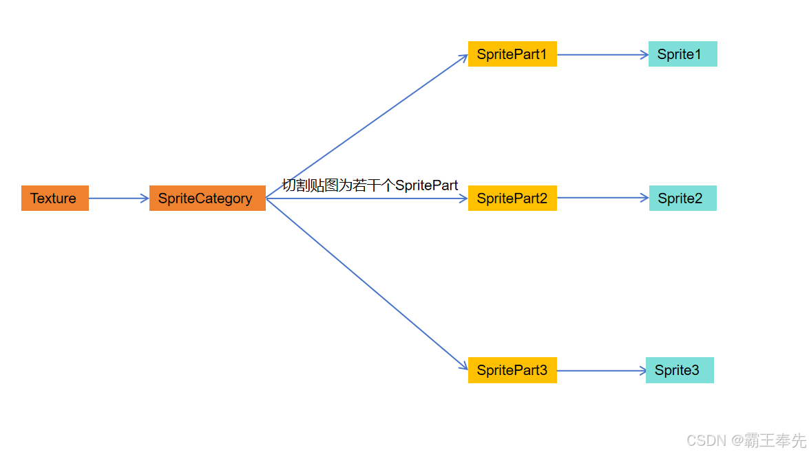

# 骑砍Ⅱ霸主MOD开发(5)-2D界面

> 来源: https://blog.csdn.net/qq_35829452/article/details/137968808
> 专栏: [骑砍Ⅱ霸主MOD开发教程](https://blog.csdn.net/qq_35829452/category_12538930.html)

---

                    一.2D界面

    <1.2D界面ScreenBase

         2D界面 = 多个GauntletLayer(菜单/对话框/定制2D页面) + SceneLayer(3D页面)

主界面:MBInitialScreenBase
大地图界面:MapScreen
Mission界面:MissionScreen
自定义战斗页面:CustomBattleScreen

     <2.2D界面切换

#获取当前屏幕
ScreenManager.TopScreen
#将屏幕推向栈顶
ScreenManager.PushScreen
#将屏幕从栈顶弹出
ScreenManager.PopScreen

     <3.2D界面RGL调试&查看页面组成架构

#本体2D页面实现方式切换(采用/不采用GUI中Prefabs文件夹)
ui.use_generated_prefabs 1
#弹出2D页面层次架构信息
ui.set_screen_debug_information_enabled True
#开启Debug模式(修改配置文件会刷新ScreenBase中的控件)
ui.set_debug_mode 1
#禁用UI
ui.toggle_ui
#打开仓库搜索页面
ui.set_inventory_search_enabled 1

二.2D图层(GauntletLayer)

     <1.GauntletLayer组成

          GauntletLayer = Movie(静态HTML页面) + ViewModel(动态数据)

     <2.创建Movie

#创建GUI/Prefabs文件夹,新增HTML页面Test.xml
 
<Prefab>
  <Window>
     <Widget id="RootWidget" Command.MouseDown="LbtnClick" Command.MouseAlternateDown="RbtnClick">
		<Children>
            <ButtonWidget Command.Click="ExecuteSearch"/>
            <TextWidget Text="@Text"/>
        </Children>
	</Widget>
  </Window>
</Prefab>

#每个HTML页面都有一个根节点RootWidget,RootWidget长宽决定了HTML页面大小
Widget rootWidget = IGauntletMovie.RootWidget

     <3.创建ViewModel

#Text与HTML界面中@Text形成映射关系 ExecuteSearch与按钮点击事件形成映射
public class TestVM : ViewModel
{
   private string _text;

   public void LBtnClick()
   {
   }

   public void RbtnClick()
   {
   }

   public void ExecuteSearch()
   {
   }

   [DataSourceProperty]
   public string Text
   {
     get
     {
        return this._text;
     }
     set
     {
        if (this._text != value)
        {
            this._text = value;
            base.OnPropertyChangedWithValue<string>(value, "Text");
        }
     }
   }
}

     <4.创建GauntletLayer

#1.在Screen中新增GauntletLayer,优先级为10,多个Layer采用高优先级覆盖低优先级策略
   GauntletLayer gauntletLayer = new GauntletLayer(10, "GauntletLayer", false);

#2.在GauntletLayer加载Movie(ArmyComposition映射为GUI/Prefabs/ArmyComposition.xml)
   gauntletLayer.LoadMovie("ArmyComposition", new ViewModel());

#3.在当前Screen中添加该Layer
   MissionScreen.AddLayer(gauntletLayer);

     <5.设置GauntletLayer聚焦

          当屏幕切换,新的Layer加载时,原有Layer会被去激活或失去鼠标焦点

#1.设置该Layer是否会被事件响应,鼠标点击,键盘事件
   gauntletLayer.InputRestrictions.SetInputRestrictions()

#2.当前鼠标聚焦该Layer
   ScreenManager.TrySetFocus();

三.2D控件(Widget)

     与网页HTML相同,组成Movie的基本元素为控件Widget,例如文本框,下拉框,按钮等.

     <1.控件颜色&字体大小

          GUI/Brushes中创建Brushes.xml

<Brushes>
  <Brush Name="My.Text" Font="Galahad" TextHorizontalAlignment="Left">
    <Styles>
      <Style Name="Default" FontColor="#E1E1E1FF" TextGlowColor="#000000FF" TextOutlineColor="#000000FF" TextOutlineAmount="0.3" TextGlowRadius="0.1"  TextBlur="0.5"  FontSize="15" />
    </Styles>
  </Brush>
</Brushes>

     <2.控件坐标&偏移量

          Gui/Prefabs/Movies.xml中配置控件属性

#配置Widget水平居中,长宽高等属性
<Widget 
    WidthSizePolicy="Fixed" 
    HeightSizePolicy="Fixed" 
    SuggestedWidth="900" 
    SuggestedHeight="3" 
    HorizontalAlignment="Center" 
    VerticalAlignment="Top">
</Widget>

     <3.控件背景图片

         1.Sprite类型背景图片(通过对资产Asset中纹理图片进行预处理得到的静态图片)

            #1.预处理流程

            #2.创建SpriteData.xml

<SpriteData>
  #声明TPAC资产中logo纹理图片为SpriteCategory
  <SpriteCategories>
    <SpriteCategory>
      <Name>logo</Name>
      <AlwaysLoad />
      <SpriteSheetCount>1</SpriteSheetCount>
      <SpriteSheetSize ID="1" Width="1920" Height="1080" />
    </SpriteCategory>
  </SpriteCategories>

  #将logo纹理图片进行切割,得到若干个不同的SpritePart
  <SpriteParts>
    <SpritePart>
		<SheetID>1</SheetID>
		<Name>Logo</Name>
		<Width>1920</Width>
		<Height>1080</Height>
		<SheetX>0</SheetX>
		<SheetY>0</SheetY>
		<CategoryName>pl_logo</CategoryName>
    </SpritePart>
  </SpriteParts>

  #每个SpritePart映射为独立的Sprite提供给Widget使用
  <Sprites>
    <GenericSprite>
      <Name>Logo</Name>
      <SpritePartName>Logo</SpritePartName>
    </GenericSprite>
  </Sprites>
</SpriteData>

            #3.动态加载Sprite

#常驻内存SpriteCategory:SpriteCategory.AlwaysLoad = true 适用于Logo等加载图
#动态加载SpriteCategory:SpriteCategory.AlwaysLoad = false 适用于游戏场景中图片

public static void LoadSpriteCategory(string categoryName)
{
   UIResourceManager.SpriteData.SpriteCategories[categoryName]
     .Load(UIResourceManager.ResourceContext, UIResourceManager.UIResourceDepot);
}

public static void UnloadSpriteCategory(string categoryName)
{
   UIResourceManager.SpriteData.SpriteCategories[categoryName].Unload();
}

         2.Texture类型背景图片(自定义纹理图片,可根据需求动态生成)

            #1.自定义Widget,继承TextureWidget

    public class MyTextureWidget : TextureWidget
    {
        public MyTextureWidget(UIContext context) : base(context)
        {
            TextureProviderName = "MyTextureProvider";
        }
    }

            #2.创建TextureProvider

public class MyTextureProvider : TextureProvider
{
   public override Texture GetTexture(TwoDimensionContext twoDimensionContext, string name)
   {
        #构建属于自己的Texture
   }
} 

            #3.在Movie对应页面中添加自定义Widget

#配置Widget水平居中,长宽高等属性
<MyTextureWidget
    WidthSizePolicy="Fixed" 
    HeightSizePolicy="Fixed" 
    SuggestedWidth="900" 
    SuggestedHeight="3" 
    HorizontalAlignment="Center" 
    VerticalAlignment="Top">
</MyTextureWidget>

四.定制化2D页面-游戏菜单(GameMenu)

      <1.MBSubModuleBase中重写OnGameStart(Game game, IGameStarter gameStarterObject)

      <2.获取CampaignGameStarter后调用AddGameMenu实现游戏菜单的初始化

      <3.大地图中创建CampaignBehavior并activate游戏菜单

protected override void OnGameStart(Game game, IGameStarter gameStarterObject)
{
    base.OnGameStart(game, gameStarterObject);
    if (gameStarterObject is CampaignGameStarter)
    {
       CampaignGameStarter starter = (CampaignGameStarter)gameStarterObject;
       starter.AddGameMenu("p_jump_mission", "jump mission ready.",
           new OnInitDelegate(MenuInit), GameOverlays.MenuOverlayType.None, 
           GameMenu.MenuFlags.None, null);
       starter.AddGameMenuOption("p_jump_mission", "p_jump_miision_continue",
           "ready jump mission.", new GameMenuOption.OnConditionDelegate(MenuCondition),
           new GameMenuOption.OnConsequenceDelegate(MenuConsequence),
          false, -1, false, null);
       starter.AddBehavior(new MyCampaignBehavior());
    }
}

public void MenuInit(MenuCallbackArgs args)
{
   InformationManager.DisplayMessage(new
   InformationMessage(string.Format("p_mission_jump_game_menu_init")));
}

public bool MenuCondition(MenuCallbackArgs args)
{
   InformationManager.DisplayMessage(new
InformationMessage(string.Format("p_mission_jump_game_menu_condition")));
   return true;
}

public void MenuConsequence(MenuCallbackArgs args)
{
   GameMenu.ExitToLast();
}

public class MyCampaignBehavior : CampaignBehaviorBase
{

   public override void RegisterEvents()
   {
      CampaignEvents.TickEvent.AddNonSerializedListener(this, MyCampaignTick);
   }

   public void MyCampaignTick(float dt)
   {
      if (TaleWorlds.InputSystem.Input.IsKeyPressed(InputKey.Numpad8))
      {
           GameMenu.ActivateGameMenu("p_jump_mission");
      }
   }

五.定制化2D页面-游戏对话框(Dialog)

     1.DialogState(决定对话触发时机和场景)

this.stateMap = new Dictionary<string, int>();
this.stateMap.Add("start", 0);
this.stateMap.Add("event_triggered", 1);
this.stateMap.Add("member_chat", 2);
this.stateMap.Add("prisoner_chat", 3);
this.stateMap.Add("close_window", 4);

      2.添加自定义对话内容

          <1.MBSubModuleBase中重写OnGameStart,获取CampaginGameStarter

          <2.获取CampaignGameStarter后添加CampaignBehavior

          <3.在CampaignBehavior中添加OnSessionLaunched回调

          <4.在CampaginBehavior中使用CampaignGameStarter添加dlalogs

          <5.为dialogs添加对话弹出条件和结果

        public class CampaignPLGUIView : CampaignBehaviorBase
        {

            public override void RegisterEvents()
            {
                CampaignEvents.OnSessionLaunchedEvent.AddNonSerializedListener(this, OnSessionLaunchedEvent);
            }

            public void OnSessionLaunchedEvent(CampaignGameStarter starter)
            {
                starter.AddDialogLine("arena_master_tournament_meet", "start", "arena_master_enter_practice_fight_confirm", "{=GAsVO8cZ}Good day, friend. I'll bet you came here for the games, or as they say nowadays, the tournament!",
                   null, null, 100, null);
                starter.AddPlayerLine("arena_master_enter_practice_fight_confirm", "arena_master_enter_practice_fight_confirm", "close_window",
                    "{=arena_master_35}I'll do that.", null,
                    new ConversationSentence.OnConsequenceDelegate(ArenaMasterCampaignBehavior.conversation_arena_join_fight_on_consequence), 100, null, null);
            }
        }

                
