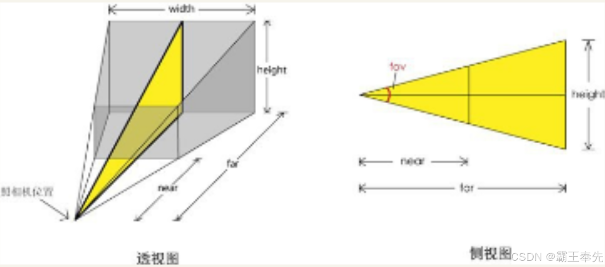

# 骑砍Ⅱ霸主MOD开发(7)-坐标&坐标系转化&摄像机

> 来源: https://blog.csdn.net/qq_35829452/article/details/138147153
> 专栏: [骑砍Ⅱ霸主MOD开发教程](https://blog.csdn.net/qq_35829452/category_12538930.html)

---

                    一.坐标

    GameEntity的坐标信息使用MatrixFrame描述,由旋转矩阵+坐标X,Y,Z进行描述

    MatrixFrame  = Vec3 (坐标X,Y,Z) + Mat3(旋转矩阵)

    <1.Vec3

#向某个方向运动(向量加法运算实现,获取方向的单位向量 + 坐标向量)
float distance = 5f;
Vec3 direction = Mat3.Identity.f;
direction.Normalize();
Vec3 position = new Vec3(0f, 0f, 0f);
position += direction * distance;

    <2.Mat3

#Mat3旋转矩阵对应的3个方向向量f,s,u(右手坐标系中前,右,上方向),沿着三个方向进行旋转
Mat3.Identity.f
Mat3.Identity.s
Mat3.Identity.u
Mat3.Identity.RotateAboutForward(30f * MathF.DegToRad)
Mat3.Identity.RotateAboutSide(30f * MathF.DegToRad)
Mat3.Identity.RotateAboutUp(30f * MathF.DegToRad)

#Mat3旋转矩阵转欧拉角
Mat3.Identity.GetEulerAngles()

#欧拉角转MAT3旋转矩阵
Mat3.Identity.ApplyEulerAngles()

    <3.角度制和弧度制

#角度转弧度
float angle = 45 * MathF.DegToRad
#弧度转角度
float angle = 3.1415926 * MathF.RadToDeg

二.相对坐标与绝对坐标

    <1.获取相对坐标&绝对坐标

#获取相对坐标
GameEntity.getFrame()

#获取绝对坐标
GameEntity.getGlobalFrame()

    <2.绝对坐标→相对坐标

MatrixFrame.TransformToLocal()

    <3.相对坐标→绝对坐标

MatrixFrame.TransformToParent()

三.世界坐标与局部坐标转化

#世界坐标系下的旋转矩阵
Mat3 rotation = Mat3.Identity

#局部坐标系下的旋转矩阵
Mat3 rotation = new Mat3(new Vec3(1f, 0f, 0f, -1f), new Vec3(0f, 1f, 0f, -1f), new Vec3(0f, 0f, 1f, -1f))

四.世界坐标与屏幕坐标转化

    <1.世界坐标系→屏幕坐标系

MBWindowManager.WorldToScreen()
MBWindowManager.WorldToScreenInsideUsableArea()
MBWindowManager.WorldToScreenWithFixedZ()

    <2.屏幕坐标系→世界坐标系

#输出屏幕坐标系对应世界坐标系
MBWindowManager.ScreenToWorld()

#输出鼠标所在屏幕坐标系对应世界坐标系,射线开始点为鼠标对应世界坐标系
Camera.ScreenSpaceRayProjection()

#输出鼠标所在屏幕坐标系对应世界坐标系,射线开始点为鼠标对应世界坐标系
SceneView.TranslateMouse();

五.Camera

    <1.创建Camera实例(GameEntity)

Camera camera = Camera.CreateCamera()

    <2.SceneView设置Camera

MissionScreen.CombatCamera.Frame = MatrixFrame.Zero;
MissionScreen.SceneView.SetCamera(MissionScreen.CombatCamera);

    <3.设置Camera视野Zoom

#近点距离near,远点距离far,裁剪平面参数left,right,bottom,top
Camera.SetViewVolume()
Camera.SetFovHorizontal();
Camera.SetFovVertical();

六.第三人称视角&第一人称视角&定制化视角

    不同视角模式下功能实现通过MissionScreen实现.

    <1.CustomCamera

       藏身处视角转化,士兵视角转化通过设置MissionScreen.CustomCamera实现.

    <2._zoomAmout

       摄像机视野大小通过MissionScreen._zoomAmount实现,转化公式如下:

this._zoomAmount = MBMath.ClampFloat(this._zoomAmount, 0f, 1f);
float valueTo = 37f / this.MaxCameraZoom;
this.CameraViewAngle = MBMath.Lerp(Mission.GetFirstPersonFov(), valueTo, this._zoomAmount, 0.005f);
this.CustomCamera.SetFovVertical(this._cameraSpecialCurrentFOV * (this.CameraViewAngle / 65f) * 0.017453292f, Screen.AspectRatio, 0.065f, 12500f);

    <3.CameraBearing&CameraElevation

       第三人称视角随人物观察方向变化而变化通过CameraBearing&CameraElevation实现

this.CameraBearing = (this.Mission.CameraIsFirstPerson ? 
    mainAgent2.LookDirection.RotationZ : 
    mainAgent2.MovementDirectionAsAngle);
this.CameraElevation = (this.Mission.CameraIsFirstPerson ?             
    mainAgent2.LookDirection.RotationX : 0f);

七.射线检测法获取鼠标点地坐标

    <1.鼠标的2D坐标转化为世界坐标后,获得鼠标方向的一条射线

#输出屏幕坐标系对应世界坐标系
MBWindowManager.ScreenToWorld()

#输出鼠标所在屏幕坐标系对应世界坐标系,射线开始点为鼠标对应世界坐标系
Camera.ScreenSpaceRayProjection()

#输出鼠标所在屏幕坐标系对应世界坐标系,射线开始点为鼠标对应世界坐标系
SceneView.TranslateMouse();

    <2.射线与游戏中地形,GameEntity发生碰撞获得点地坐标

#获取鼠标点击的Agent
Mission.RayCastForClosestAgent()

#获取鼠标点击的GameEntity
Scene.RayCastForClosestEntityOrTerrain()

                
