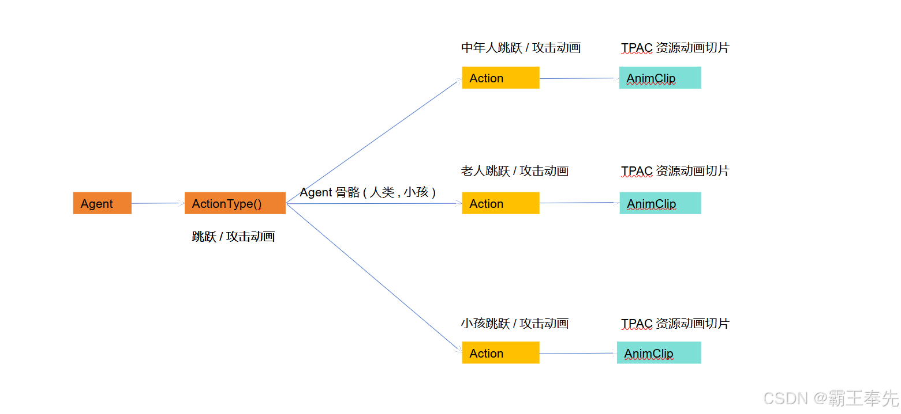

# 骑砍Ⅱ霸主MOD开发(8)-骨骼动画

> 来源: https://blog.csdn.net/qq_35829452/article/details/138151324
> 专栏: [骑砍Ⅱ霸主MOD开发教程](https://blog.csdn.net/qq_35829452/category_12538930.html)

---

                    一.骨骼动画(skeleton_animation)

     原始骨骼动画采样数据,格式与标准骨骼动画一致。

二.骨骼动画切片(animation_clip)

     对标准骨骼动画进行采样,加上定制化参数得到自定义骨骼动画。

     <1.起始帧&结束帧&预缓存大小

          自定义骨骼动画会进行动画数据缓存,根据持续时长,帧数量进行统计计算.

start_frame:截取骨骼动画开始帧
end_frame:截取骨骼动画结束帧

     <2.动作混合

          将不同的动画进行插值运算得到更好的动作捕捉,例如架枪时动作采用混合方式实现.

BlendAction:混合的动作
BlendAnimation:混合的animation_clip

     <3.动作接续

ContinueAction:可与四向格挡动作进行动作混合

     <4.动作声音

          弩发射时声音,马匹奔跑时声音与动作相关.

MakeSound:可播放2D/3D类型声音

     <5.战斗系统参数combat_parameters

          基于四向攻击设计的动作参数,包括动作仰角,环视方向,物理碰撞检测等参数通过XML进行配置.配置文件:ModuleData\combat_parameters.xml

vertical_rot_limit_multiplier_up:使用弩/弓时动作仰角和观察方向最大仰角
vertical_rot_limit_multiplier_down:使用弩/弓时动作仰角和观察方向最低仰角
collision_radius:基于右手骨骼+武器偏移量生成的胶囊碰撞体半径

     <6.动作特殊标识

enforce_lowerbody/enforce_all:上半身动画和全身动画
ignore_all_collisions/ignore_static_body_collisions:骨骼动画物理碰撞检测

三.动作类型&动作集合(ActionSet&ActionType)

    为Agent定制化设计的骨骼动画切片为动作ActionSet,通过action_types.xml和action_sets.xml进行配置.

四.动作缓存(ActionIndexCache)

    action_types.xml和action_sets.xml全局初始化后会进行缓存,在内存中保留每个ActionType的唯一索引。

#获取Action配置文件中的缓存索引,便于后续播放
MBAnimation.GetAnimationIndexWithName()

五.播放骨骼动画

   1.播放GameEntity对应动画

       <1.根据动画切片animation_clip名称获取索引index

#获取TPAC资源文件中animation_clip对应Index
MBAnimation.GetAnimationIndexWithName()

       <2.播放动画切片

#动画播放
GameEntity.Skeleton.SetAnimationAtChannel();

   2.播放Agent对应动画

       <1.根据action_type中配置名称获取ActionIndexCache

ActionIndexCache.Create("act_jump_loop");

       <2.根据Agent当前对应ActionSet获取实际对应animation_clip动画切片索引index

#根据Agent参数获取ActionSetCode
ActionSetCode.GenerateActionSetNameWithSuffix()

#设置Agent对应ActionSet
Mission.MainAgent.SetActionSet()

       <3.播放动画切片

#人物Agent骨骼动画播放 ActionChannel = 0 全身动画  ActionChannel = 1 上半身动画
Mission.MainAgent.SetActionChannel();

                
