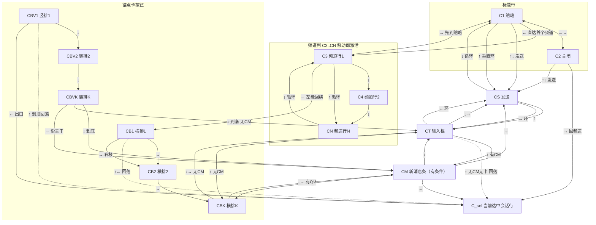
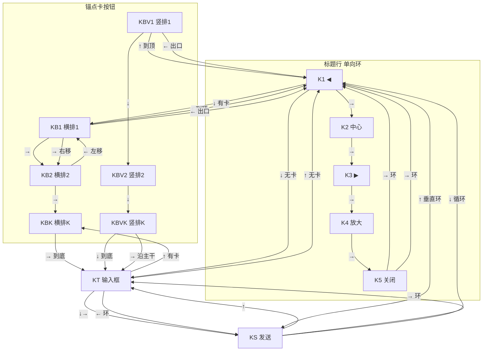
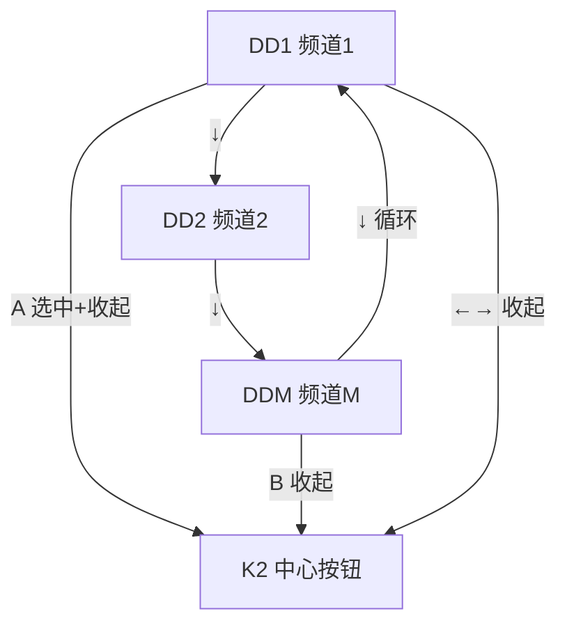

# IM 手柄手动导航 — 完整设计（逐按钮 × 方向转移矩阵）

> **状态**：🔧 已实现（2026-08-18，双版本编译通过；实机多轮测试后的方案判定/坑点复盘见 §十一，新 session 必读；待验证清单见 §十二）
> **主题**：IM 面板（完整/缩略）手柄导航的**手动实现**——每个可聚焦元素定义「按 ↑↓←→ 各移动到哪 + A 激活动作」，确定性可控，替代引擎 `<NavigationScopeTargeter>` 黑盒（实测：prefab 已声明 scope 但十字键无效果、无焦点视觉）。
> **关联**：[im-layer-and-input-design.md](im-layer-and-input-design.md)（Q4 手柄支持，本文件为其 §4.4/§4.7 的落地实现方案）

**v3 修订记录（2026-08-18，对照 ImChat.xml / ImChatCompact.xml 结构核对后）**：
1. **竖排按钮卡变体（P1）**：锚点卡按钮分横排/竖排两套渲染，数据源互斥（`CardButtons` vs `VerticalCardButtons`——任一按钮文本超长即整组转竖排，见 ImChatVM.RebuildCardButtons）。CB/KB 枚举改 `IsVerticalButtons ? VerticalCardButtons : CardButtons`，矩阵拆横排/竖排两变体（竖排：↑↓ 按钮间移动、←→ 无操作）；dirty 比对增加 `IsVerticalButtons`（横竖翻转按钮数不变也不漏报）。
2. **卡片按钮 GetWidget 按消息索引定位（P1）**：`LWN_ImChat_BubbleCard` 在 ItemTemplate 里每张卡重复，`FindWidgetById` 命中树中第一张（旧卡）→ 高亮错位。完整模式改 `LWN_ImChat_MessageInner.GetChild(锚点消息索引)` 取行、行内按锚点卡类型分叉（卡片气泡 / 旧格式计划卡 `LWN_ImChat_PlanCardBody`）；缩略模式单卡（`LWN_ImChat_CompactCard` 全树唯一）保持 FindWidgetById。
3. **焦点滚动跟随**：焦点落到频道行/卡片按钮/下拉项且目标在视口外 → 对应面板滚动把目标滚入视野（频道列 / 消息流 / 下拉列表），消除「焦点隐形」。
4. **重建焦点身份映射**：重建后按焦点项稳定 Id 映射旧焦点（禁止裸索引保持——CM 插入/删除会整体错位），映射失败再钳制。
5. **CT↑ 兜底改 C_sel**：输入框无 CM 无卡时 ↑ 落 C_sel（不切会话）——原 CN 兜底会从输入框把会话切到最后一条，违背回落纪律。
6. **下拉初始焦点 = 当前选中项**：下拉接管后落 `IsSelected` 项（20+ 频道时落首项太远）。

**v2 修订记录（2026-08-17 评审后）**：
1. **回落点规则**：离开频道列后（标题带 ↓ / 锚点卡 ←↑）的回落点 = **当前选中会话所在行 C_sel**（按 `_selected.Id` 定位），不再硬编码「第一个频道行 C3」——原设计在焦点 C7 时 ↑→↓ 会触发「移动即激活」把会话误切到第一个频道（Fix 1）。
2. **卡片按钮行焦点视觉**：CB 按钮的 `GetWidget` = 锚点卡气泡按钮行 ListPanel 按 CardButtons 顺序取子项，`SetState("Hovered")`——不再依赖「自身选中态」（整行高亮 ≠ 按钮级焦点，玩家看不见光标在哪个按钮上，违反「焦点必须可见」目标）（Fix 2）。（⚠️ v3 已重写定位方式为「按消息索引取行」，见上）
3. **手柄滚消息**：新增 LB/RB 翻页滚动（完整模式；复用 HandleManualScroll 的 scrollbar 语义）——原设计手柄玩家完全无法翻阅消息历史（Fix 3，待实机确认手感）。
4. **重建节流**：`_padNavDirty` 只在**结构变化**时置位（锚点卡引用变 / 按钮集数量变 / 模式切换 / 切会话 / 下拉开关），0.3s 轮询 RefreshMessages 不直接置 dirty——防 0.3s 一重建的焦点跳变与长按抖动（Fix 4）。

---

## 一、背景与裁定

1. **引擎 scope 实测失败**（2026-08-17 手柄实机）：两个 prefab 已加 `<NavigationScopeTargeter>` + `GamepadNavigationIndex`，但 IM 打开后**十字键无任何效果、无焦点视觉**。引擎导航激活是多环节黑盒（scope 注册 → 引擎输入分发 → 初始焦点），跨版本属性名差异（v1.2.12）风险未消。
2. **用户裁定**（2026-08-17）：「设计下每一个按钮 hover 状态时候，下一个应该自动移动到什么地方，然后用 A 来按下」——**手动导航**：显式定义每个元素的焦点转移 + A 激活动作。
3. **已有基础**：Mission 内手柄模态冻结（`SetPlayerControlFrozen`，冻结只冻角色 Agent 不冻 UI）；B 键收下拉/关闭已有；`UpdatePadFocus` 轮询点已在 Tick（改造为手动导航驱动）；手柄提示行/键帽已有；缩略下拉手动命中 SetState 先例（HandleCompactInput）。

---

## 二、导航模型

- **焦点项**：`PadItem { Id, Label, OnActivate(Action), GetWidget(Func<Widget>), 组标识 }` 列表 `_padItems`。
- **焦点索引** `_padIndex`：唯一当前焦点；`-1` = 无焦点（面板刚开/非手柄）。
- **重建**（`_padNavDirty` → `RebuildPadNavigation`）：**只在结构变化时置 dirty**——① 模式切换；② 切会话；③ 锚点卡结构变化（`UpdateCardAnchors` 的 `latestCard` 引用变更，或锚点卡按钮数变更，或 **`IsVerticalButtons` 横竖翻转**——缓存 `_padNavAnchorRef`（ImMessage 引用）+ 按钮数 + `IsVerticalButtons`，每轮比对）；④ 下拉开/关。**0.3s 定时 RefreshMessages 不置 dirty**（不满足上述条件 = 结构未变，重建无意义且抖动焦点）。**重建后焦点按稳定 Id 映射旧项（v3，见 §六.6），不裸保持索引。**
- **移动**：十字键按下沿移动；按住 0.4s 后每 0.18s 重复（手感；每方向独立计时，抬起即复位）。
- **激活**：A（`ControllerRDown`）按下沿 → `_padItems[_padIndex].OnActivate()`。
- **滚动**：LB（`ControllerL1`）/ RB（`ControllerR1`）按下沿 + 长按重复 → 消息流上翻/下翻一页（`sb.ValueFloat = clamp(±0.4 × MaxValue)`，复用 HandleManualScroll 的 scrollbar 语义与贴底状态机：上翻解锁 `_pinnedToBottom=false`，下翻到底 `IsMessageAtBottom()` 重新锁定）。仅完整模式；缩略模式无消息流滚动 → LB/RB 无操作；下拉打开 / 输入框聚焦（软键盘）期间暂停。
- **视觉**：焦点项 `SetState("Hovered")`（复用 hover 视觉零新 Brush）；旧焦点按身份复位（`ButtonWidget.IsSelected ? "Selected" : "Default"`）。
  - 频道行（无独立 widget 引用）：焦点 = 移动即激活 → 选中态跟随，自身 IsSelected 视觉即焦点视觉，无额外处理。
  - **卡片按钮（Fix 2 / v3 定位重写）**：`GetWidget` = 锚点卡按钮行，**按消息索引定位**（完整模式：`LWN_ImChat_MessageInner.GetChild(锚点消息索引)` 行内按锚点卡类型分叉取按钮行；缩略：`LWN_ImChat_CompactCard` 单卡）→ 按按钮序取第 j 个子项 → `SetState("Hovered")`；旧按钮按身份复位。查找失败（按钮行未构建/不可见）→ 该项仍可 A 激活，视觉暂缺（瞬态，重建后补齐）。🔴 禁止对 ItemTemplate 内重复 Id（`LWN_ImChat_BubbleCard`）用 `FindWidgetById`——命中树中第一张旧卡，高亮错位。详见 §六.2。
  - 下拉项：`SetState("Hovered")`（手动命中逻辑已有同类 SetState 先例）。
- **回落点规则（Fix 1）**：完整模式离开频道列后的回落点 = **当前选中会话所在行 C_sel**（`_selected.Id` 在频道行列表中定位；不在列表的边缘情况 → 兜底 C3 第一个频道行）。回落命中当前行 = 激活无操作（同一会话），**不误切会话**。**适用范围（v3）**：标题带 ↓、锚点卡 ←↑、**输入框 ↑ 兜底**（无 CM 无卡时）一律走 C_sel——禁止从输入框 ↑ 落 CN（会切会话）。
- **焦点滚动跟随（v3）**：MovePad 落到新焦点后，若目标 widget 在视口外 → 对应面板滚动把目标滚入视野（频道行 → ChannelScroll；卡片按钮 → MessageScroll；下拉项 → 下拉内 ScrollablePanel），只在目标真正不可见时触发一次，不干扰 LB/RB 手动翻页。详见 §六.5。
- **初始焦点** = 索引 0（打开/模式切换后立即可见——解决「看不到焦点在哪」）。
- **门控**：仅 `ModInput.UsingGamepad`（设备切换 → 焦点复位，已有范式）；鼠标玩家不跑。

---

## 三、完整模式（ImChat.xml）转移矩阵

**可聚焦元素清单**（构建顺序 = 屏幕视觉顺序）：

| 焦点 ID | 元素 | 视觉 widget | A 激活 |
|---|---|---|---|
| C1 | 标题带「缩略」按钮 | `LWN_BtnCompact`（**prefab 新增 Id**） | `ToggleCompact()` |
| C2 | 标题带「关闭」按钮 | `LWN_BtnClose`（**prefab 新增 Id**） | `Close()` |
| C3..CN | 左栏频道行（动态，跳过分组标题） | 无（自身 IsSelected 视觉；移动即激活） | 移动即实时 `SelectConversation`（微信式预览） |
| CB1..CBK / CBV1..CBVK | 锚点卡按钮（动态，`_vm.Messages` 锚点卡 `IsVerticalButtons ? VerticalCardButtons : CardButtons` 逐按钮；横排/竖排两变体） | **锚点卡按钮行按消息索引取行再取子项（v3，见 §六.2）** | 各 `ImButtonVM.Execute()`（批准/拒绝/自审/中止/制定计划…） |
| CM | 「有新消息」提示条（仅 `HasNewMessageHint` 可见时入列） | `LWN_BtnNewMsg`（**prefab 新增 Id**） | `ExecuteNewMessageClick()` |
| CT | 输入框 | `LWN_ImChat_Input`（Id 已有） | `EventManager.SetFocusedWidget`（弹软键盘） |
| CS | 发送按钮 | `LWN_BtnSend`（**prefab 新增 Id**） | `ExecuteSend()` |

**转移矩阵**（行 = 当前焦点，列 = 按方向后去向；**C_sel = 当前选中会话所在行，兜底 C1**）：
> 🔴 **v4（2026-08-18 用户裁定：每个按钮在每个十字键方向都有通路——禁止无感知死区）**：
> 死区全部按「空间邻近 → 回绕」打通——水平边界回绕成环（标题带 / 输入区 / 缩略标题行），
> 左缘元素回绕进消息区，竖排按钮横向 = 出组。**唯一保留的"无通路" = 空频道列表等不可达边缘**。
> 🔴 **v5（2026-08-19 用户裁定：完整模式按直觉重构——频道列是独立的环，标题带是独立的门）**：
> ① 频道列 ↑↓ **只在列内循环**（首行↑→末行、末行↓→首行），绝不因 ↑↓ 跑到缩略/发送；
> ② 水平环 = **频道 → C1 缩略 → C2 关闭 → C_sel（回当前选中行）**——→ 从频道进标题带、绕回频道；
> ③ C1/C2 的 **↑↓ 都是发送**（标题带 = 直达发送的门）。C1← 直达首频道（v4 用户裁定）保留。

| 当前焦点 | ↑（上） | ↓（下） | ←（左） | →（右） |
|---|---|---|---|---|
| **C1 缩略** | **CS（v5：↑ 发送）** | **CS（v5：↓ 发送）** | **C3 第一个频道行**（缩略按钮左侧 = 频道列；无频道行 → C_sel） | C2 |
| **C2 关闭** | **CS（v5：↑ 发送）** | **CS（v5：↓ 发送）** | C1 | **C_sel（v5：→ 回频道，水平环闭合）** |
| **C3..CN 频道行（第 i 行）** | 上一行 C(i-1)；**首行 → 末行（v5 列内循环）** | 下一行 C(i+1)；**末行 → 首行（v5 列内循环）** | **有锚点卡 ? CB1 : CT（左缘回绕进消息区）** | **C1 缩略（v5：→ 先到缩略）** |
| **CB1..CBK 锚点卡按钮·横排（第 j 个）** | **C_sel**（选中行；无频道行 → C1） | CM（有新消息条）? CM : CT | **C_sel**（选中行） | 下一个卡按钮 CB(j+1)；最后一个 → CM（有新消息条）? CM : CT |
| **CBV1..CBVK 锚点卡按钮·竖排（第 j 个，长文本按钮）** | 上一个按钮 CBV(j-1)；已到顶 → **C_sel** | 下一个按钮 CBV(j+1)；已到底 → CM（有新消息条）? CM : CT | **C_sel（退出左栏）** | **CM（有新消息条）? CM : CT（沿主干向下）** |
| **CM 新消息条** | 上一项（CBK 或 C_sel 或 C1） | CT | **C_sel（回左栏选中行）** | **CS（右下发送）** |
| **CT 输入框** | 上一项（CM ? CM : CBK ? CBK : **C_sel**（无频道行 → C1）） | CS | **CS（输入区环）** | CS |
| **CS 发送** | CT | C1（主干底部循环回顶部） | CT | **CT（输入区环完成）** |

**规则摘要**：
1. **🔴 v5 结构（2026-08-19 用户裁定）**：频道列 = 独立纵环（↑↓ 不出列）；标题带 = 独立水平环（频道→C1→C2→C_sel）；C1/C2 = 直达发送的门（↑↓→CS）；发送/输入/卡按钮/CM 走底部纵向链（CS↑→CT→↑→CM/CBK/C_sel），CS↓→C1 主干循环保留。
2. **水平（v5）**：频道行→C1（先到缩略）→C2（关闭）→回 C_sel（环闭合）；标题带 C1↔C2 双向；输入区 CT⇄CS 双向环；锚点卡→频道行（左，回落选中行）。**竖排按钮水平 = 出组（← 退 C_sel / → 沿主干向下）。**
3. **循环（v5）**：频道列首↔末（↑↓）；CS ↓ → C1；CT ← / CS → 输入区环。
4. **回落点（Fix 1 / v3，v5 适用范围收窄）**：锚点卡 ←↑ / **输入框 ↑ 兜底** 回 **C_sel**（当前选中行）——「移动即激活」下落到别的行 = 误切会话；**标题带 ↓ 不再回落（v5 改直达发送）**。C_sel 不在列表（边缘）→ **C1 兜底**。
5. **竖排按钮卡（v3 / v4）**：锚点卡按钮长文本 → 整组转竖排（VerticalCardButtons），↑↓ 在按钮间移动；← = 退出左栏 C_sel；→ = 沿主干向下（CM?CT）。
6. **动态收缩**：无频道行（空列表）→ C1↓直达 CT；无锚点卡 → 频道行↓直达 CM/CT；CM 不可见 → 从矩阵剔除（锚点卡↓直达 CT）。
7. **滚动**：LB/RB 翻页（见导航模型；与焦点移动互不干扰，焦点不因滚动变化）；焦点越界时滚动跟随（见 §六.5）。
8. **🔴 无死区纪律（v4，用户裁定 2026-08-18）**：每个按钮每个十字键方向都有通路——水平边界回绕成环、左缘元素回绕进消息区（频道行 ← = 与 → 同目标）、竖排横向 = 出组。**C1 ← 直达第一个频道行**（v4 裁定保留，v5 未改动）。唯一保留的"无通路" = 空频道列表等不可达边缘。
9. **卡按钮可达性（v5 变化）**：频道列 ↑↓ 不再出列 → 卡按钮改由底部链进入：C1/C2↓→CS→↑→CT→↑→CBK（有卡时）。

---

## 四、缩略模式（ImChatCompact.xml）转移矩阵

**可聚焦元素清单**（构建顺序 = 屏幕视觉顺序）：

| 焦点 ID | 元素 | 视觉 widget | A 激活 |
|---|---|---|---|
| K1 | ◀ 左箭头 | `LWN_BtnPrev`（**prefab 新增 Id**） | `SelectPreviousChannel()` |
| K2 | 中心按钮 | `LWN_BtnCenter`（**prefab 新增 Id**） | `ToggleChannelList()` |
| K3 | ▶ 右箭头 | `LWN_BtnNext`（**prefab 新增 Id**） | `SelectNextChannel()` |
| K4 | 放大按钮 | `LWN_BtnExpand`（**prefab 新增 Id**） | `ToggleExpand()` |
| K5 | 关闭按钮 | `LWN_BtnCloseC`（**prefab 新增 Id**） | `Close()` |
| KB1..KBK / KBV1..KBVK | 锚点卡按钮（动态，同完整模式：`IsVerticalButtons ? VerticalCardButtons : CardButtons`） | **同完整模式（v3：`LWN_ImChat_CompactCard` 单卡定位）** | 各 `ImButtonVM.Execute()` |
| KT | 输入框 | `LWN_ImChat_CompactInput`（Id 已有） | `EventManager.SetFocusedWidget` |
| KS | 发送按钮 | `LWN_BtnSendC`（**prefab 新增 Id**） | `ExecuteSend()` |

**转移矩阵**（v4 2026-08-18：无死区——标题行环补全、KB 横排双向、输入区双向环、竖排横向 = 出组）：

| 当前焦点 | ↑（上） | ↓（下） | ←（左） | →（右） |
|---|---|---|---|---|
| **K1 ◀** | **KS（垂直闭环 v4：最上 ↑ → 最下，与 KS↓→K1 成环）** | 有锚点卡 ? KB1 : KT | K5（标题行横向循环尾） | K2 |
| **K2 中心** | K3 | 有锚点卡 ? KB1 : KT | K1 | K3 |
| **K3 ▶** | K4 | 有锚点卡 ? KB1 : KT | K2 | K4 |
| **K4 放大** | K5 | 有锚点卡 ? KB1 : KT | K3 | K5 |
| **K5 关闭** | K1（标题行循环） | 有锚点卡 ? KB1 : KT | K4 | **K1（环完成）** |
| **KB1..KBK 锚点卡按钮·横排（第 j 个）** | K1（标题行首） | KT | **KB(j-1)；KB1 → K1（左缘出口）** | 下一个卡按钮 KB(j+1)；最后一个 → KT |
| **KBV1..KBVK 锚点卡按钮·竖排（第 j 个，长文本按钮）** | 上一个按钮 KBV(j-1)；已到顶 → K1 | 下一个按钮 KBV(j+1)；已到底 → KT | **K1（出口标题行）** | **KT（沿主干向下）** |
| **KT 输入框** | 上一项（KBK ? KBK : K1） | KS | **KS（输入区环）** | KS |
| **KS 发送** | KT | K1（底部循环回标题行） | KT | **KT（输入区环完成）** |

**规则摘要**：
1. **标题行 = 横向环**：K1→K2→K3→K4→K5→(回 K1) 双向环（→ 顺序、← 逆序、↑ 下一项、↓ 出组到锚点卡/输入框；v4 补全 K5 → → K1）。
2. **垂直主干**：标题行[K1..K5]→锚点卡[1..K]→KT→KS→(循环回 K1)。
3. **动态收缩**：无锚点卡 → 标题行↓直达 KT。
4. **KB ↑ 回 K1 可接受（与完整模式 C_sel 规则不冲突）**：缩略模式的标题行是环（落地不激活会话），无「回落误切」风险；完整模式的 C_sel 规则只为防「移动即激活」误切。
5. **竖排按钮卡（v3 / v4）**：长文本按钮整组转竖排（VerticalCardButtons），↑↓ 按钮间移动；← = 出口标题行 K1；→ = 沿主干向下 KT。
6. **无消息流滚动**：缩略面板固定行 A/B（锚点卡 + 最近两条），LB/RB 无操作。

**下拉打开时（特殊状态）**：
- 焦点接管为下拉项[1..M]（`LWN_ImChat_ChannelListInner` 子项）：
  | 当前 | ↑ | ↓ | ← | → | A | B |
  |---|---|---|---|---|---|---|
  | 下拉项 j | 上一项 j-1（首项 → 末项循环） | 下一项 j+1（末项 → 首项循环） | **收下拉（v4：纵向列表无横向项，← = 等同 B 收下拉，焦点回 K2）** | **收下拉（同 ←）** | `ExecuteSelect`（选中 + 收起下拉，焦点回 K2） | `CloseChannelList()`（收下拉不关面板，焦点回 K2） |
- **初始焦点（v3）** = 当前选中项（`IsSelected` 行；无 → 首项）——20+ 频道时落首项太远。
- 视觉：项 `SetState("Hovered")`（手动命中逻辑已有同类 SetState 先例）。
- **滚动跟随（v3）**：聚焦项在视口外（循环首↔末）→ 下拉内 ScrollablePanel 滚到该项可见。
- LB/RB 在下拉打开期间无操作（焦点已接管为下拉项）。

---

## 五、特殊状态与边界

| 状态 | 处理 |
|---|---|
| 软键盘弹出（KT 聚焦后） | 引擎接管输入；**导航轮询（移动/激活/滚动）暂停**（门控：`EventManager.FocusedWidget` 是输入框）；软键盘关闭后焦点回 KT（引擎回填链路——**🔴 待实机验证**，失败则降级预案：软键盘期间保持 `_padIndex` 于 KT，关闭后直接继续，不依赖引擎回填） |
| 设备切鼠标 | `UsingGamepad` 下降沿 → `_padIndex = -1` + 焦点视觉复位（已有范式） |
| 面板关闭/模式切换 | `_padIndex = -1` + `_padNavDirty = true`（下次打开重建） |
| 手柄 ↔ 鼠标同帧 | 按下沿检测用上一帧状态比较（`_lastPadUp` 等），无冲突 |
| 战斗/模态（`CanOpen` false） | 面板打不开，导航不激活 |
| 下拉打开中按 ↑↓ 之外 | 见下拉矩阵（◀▶ LB/RB 无操作） |
| 滚动与焦点共存 | LB/RB 翻页不改变焦点；滚动解锁/重锁贴底（与 HandleManualScroll 同语义） |

---

## 六、动态项构建规则（RebuildPadNavigation）

1. **频道行**（完整模式）：遍历 `_vm.ChannelList`，跳过 `IsGroupHeader`；每行一个焦点项，`OnActivate = SelectConversation(conv)`；**移动时即激活**（微信式：上下移动频道行 = 实时切换会话，A 无附加动作——已在当前行时 A 无操作）。**构建时记录 `_selected.Id` 对应的行索引 → C_sel 回落点**（Fix 1；`SelectConversation` 后置 dirty 重建，回落点恒最新）。
2. **锚点卡按钮**（两模式）：取 `_vm.Messages` 中 `IsCardAnchor` 的 VM → **`IsVerticalButtons ? VerticalCardButtons : CardButtons`**（v3：数据源互斥——任一按钮文本超长即整组转竖排，横排集合清空，见 ImChatVM.RebuildCardButtons）逐按钮 → 每个按钮一个焦点项，`OnActivate = () => ImButtonVM.Execute()`。
   - **视觉（Fix 2 / v3 定位重写）**：
     - **完整模式：按消息索引定位**——`LWN_ImChat_MessageInner.GetChild(锚点在 _vm.Messages 中的索引)` 取消息行，行内按锚点卡类型分叉：
       - 卡片气泡分支（`vm.IsLegacyPlanCard == false`）：行 child 2（卡片气泡容器）→ child 0（气泡贴内容）→ child 0（`LWN_ImChat_BubbleCard`）→ **child 3 = 横排按钮行 / child 4 = 竖排（`LWN_ImChat_CardButtonsV`）** → `GetChild(j)`；
       - 旧格式计划卡分支（`vm.IsLegacyPlanCard == true`，旧存档兜底）：行 child 4（旧格式卡容器）→ child 0（`LWN_ImChat_PlanCardBody`）→ **child 2 = 横排 / child 3 = 竖排（`LWN_ImChat_PlanCardButtonsV`）** → `GetChild(j)`。
       - 🔴 禁止 `FindWidgetById("LWN_ImChat_BubbleCard")`——ItemTemplate 内 Id 每张卡重复，命中树中第一张（历史旧卡），高亮错位。
     - **缩略模式：`FindWidgetById("LWN_ImChat_CompactCard")`**（单卡全树唯一）→ **child 3 = 横排 / child 4 = 竖排（`LWN_ImChat_CompactCardButtonsV`）** → `GetChild(j)`。
     - 查找失败（按钮行未构建/不可见）→ 返回 null（该项可激活，视觉暂缺；重建后补齐）。
   - **dirty（Fix 4 / v3）**：`_padNavAnchorRef`（锚点 ImMessage 引用）+ **按钮数 + `IsVerticalButtons`** 缓存；`UpdateCardAnchors`/`RebuildCardButtons` 每轮比对，任一变化（含横竖翻转——按钮数不变也触发）→ 置 dirty。
3. **下拉项**（缩略）：`_vm.ChannelSelector.ItemList` 逐项（仅 `IsChannelListOpen` 时）；**初始焦点 = 当前选中项**（`IsSelected`；无 → 首项，v3）。
4. **静态按钮**（C1/C2/CM/CS/K1..K5/KS）：prefab 加 Id 后 `FindWidgetById` 缓存 widget 引用（视觉 SetState 用）。
5. **焦点滚动跟随（v3）**：MovePad 落到新焦点后，若目标 widget 在视口外 → 对应面板滚动把目标滚入视野：
   - 频道行：`ChannelScroll` 滚到焦点行可见（行距 = 52 高 + 4 边距；scrollbar `ValueFloat` 按行索引换算，方向随 VerticalBottomToTop swap 补丁，实机微调）；目标行已可见则不滚。
   - 卡片按钮（完整模式）：锚点卡行不在消息流可视区 → `MessageScroll` 滚到卡片可见（与贴底状态机协同：向上滚出 → `_pinnedToBottom=false`，滚到卡即停）。
   - 下拉项（缩略）：`LWN_ImChat_ChannelList` 内 ScrollablePanel 滚到聚焦项可见（首↔末循环场景）。
   - 只在目标真正不可见时触发一次；不干扰 LB/RB 手动翻页。
6. **重建焦点保持（v3）**：焦点项带稳定 Id（静态项 = widget Id；频道行 = `channel_{会话Id}`；卡按钮 = `cardbtn_{消息Id}_{按钮序}`；CM/CT/CS/下拉项 = `cm`/`input`/`send`/`dd_{项Id}`）。`RebuildPadNavigation` 重建后 `_padIndex = 新列表.IndexOf(旧焦点Id)`；映射失败（项已消失）→ 钳制到相邻项。**禁止裸索引保持**——中间插入/删除（CM 出现、卡按钮集变化）会整体错位。

---

## 七、移动/激活/滚动输入轮询（UpdatePadFocus 重构）

```csharp
// Tick 内（UsingGamepad 门控；下拉打开 / 输入框聚焦（软键盘）时导航暂停，引擎接管）：
if (_padNavDirty) RebuildPadNavigation();
if (_padItems.Count == 0) return;
// 按下沿 + 长按重复（↑↓←→ / A / LB / RB；每方向独立 hold 计时，抬起复位）：
bool up = Input.IsKeyPressed(InputKey.ControllerLUp);
if (up && !_lastPadUp) { _padHoldUp = 0f; MovePad(-1); }            // 按下沿：立即移动一次 + 计时起点
else if (up && _padHoldUp > 0.4f) { _padRepeatUp += dt; if (_padRepeatUp > 0.18f) { _padRepeatUp = 0f; MovePad(-1); } }
else _padHoldUp = 0f;                                                // 抬起 → 复位
if (up) _padHoldUp += dt;
_lastPadUp = up;
// ↓←→ 同构（_padHoldDown/_padHoldLeft/_padHoldRight 各一组）；A：
bool a = Input.IsKeyPressed(InputKey.ControllerRDown);
if (a && !_lastPadA) ActivatePad();
_lastPadA = a;
// LB/RB 滚动（完整模式 + 下拉未开 + 输入框未聚焦；复用 HandleManualScroll scrollbar 语义）：
if (!_isDropdownOpen && !_isInputFocused)
{
    bool lb = Input.IsKeyPressed(InputKey.ControllerL1);
    if (lb && !_lastPadLB) ScrollPage(-1f);   // 上翻一页（解锁贴底）
    _lastPadLB = lb;
    bool rb = Input.IsKeyPressed(InputKey.ControllerR1);
    if (rb && !_lastPadRB) ScrollPage(1f);    // 下翻一页（到底重新锁定）
    _lastPadRB = rb;
    // 长按重复同 ↑↓ 模式（0.4s/0.18s），略
}
// 视觉：旧焦点复位（Fix 2：卡片按钮按按钮行子项身份复位）+ 新焦点 Hovered
```

- **MovePad(delta)**：按矩阵查表（当前焦点 → 目标焦点），越界钳制；频道行回落点按 C_sel；移动落位后触发焦点滚动跟随（§六.5）。
- **ActivatePad()**：`_padItems[_padIndex].OnActivate?.Invoke()`；频道行焦点项 OnActivate = 已在当前会话 → 无操作。
- **ScrollPage(dir)**：`sb.ValueFloat = clamp(sb.ValueFloat + dir × 0.4 × MaxValue, 0, MaxValue)`；`dir<0` → `_pinnedToBottom=false`；`dir>0` 且 `IsMessageAtBottom()` → `_pinnedToBottom=true`。

---

## 八、改动文件清单

| # | 文件 | 改动 |
|---|---|---|
| 1 | `ImChat/ImChatView.cs` | `UpdatePadFocus` 重构为手动导航（`_padItems/_padIndex/_padNavDirty`/`RebuildPadNavigation`/`MovePad`/`ActivatePad`/`ScrollPage`/按下沿+长按重复）；`SelectConversation`/`SwitchMode`/`RefreshMessages` 结构变化才置 `_padNavDirty`（锚点引用/按钮数/`IsVerticalButtons` 比对）；竖排按钮枚举（`VerticalCardButtons`）；卡片按钮按消息索引定位（含旧格式计划卡分叉）；焦点滚动跟随（频道列/消息流/下拉）；重建焦点身份映射；`Close` 清 `_padIndex` |
| 2 | `GUI/Prefabs/ImChat.xml` | 标题带缩略/关闭、新消息条、发送按钮加 Id（C1/C2/CM/CS 四个） |
| 3 | `GUI/Prefabs/ImChatCompact.xml` | ◀/中心/▶/放大/关闭/发送加 Id（K1..K5/KS 六个） |
| 4 | `ImChat/ImChatVM.cs` | （无改动——锚点卡按钮动作走既有 `ImButtonVM.Execute`） |

---

## 九、验证计划（手柄实机）

1. 完整模式打开 → 初始焦点 = C1（缩略按钮 Hovered 高亮可见）→ ↑↓ 沿主干移动、←→ 标题带/输入区水平切换 → 频道行移动实时切换会话 → 锚点卡按钮逐个聚焦（有卡时，**按钮级 Hovered 可见**）→ A 激活各按钮动作（批准/拒绝等）→ CS ↓ 循环回 C1。
2. **回落点（Fix 1）**：焦点到第 5+ 个频道行 → ↑ 到标题带 → ↓ 回**同一行**（会话未变）→ → 到锚点卡 → ← 回**同一行**（会话未变）。
3. 缩略模式打开 → 初始焦点 K1 → 标题行 ←→ 单向环、↓ 出组到锚点卡/输入框 → 中心 A 开下拉 → 下拉项 ↑↓ 循环 + A 选中收起 + B 收下拉不关面板 → 发送/放大/关闭激活。
4. 无锚点卡 / 无频道行 / 有新消息条 三种动态收缩场景的转移正确（矩阵分支）。
5. **滚动（Fix 3）**：LB 上翻解锁贴底（新消息不再自动弹出）、RB 下翻到底重新锁定；滚动不改变焦点；下拉打开/输入框聚焦时 LB/RB 不误滚。
6. **重建节流（Fix 4）**：消息流 0.3s 轮询刷新期间焦点不跳变；锚点卡按钮集变化（批准后按钮消失）→ 焦点按身份映射失败后钳制到剩余项且不残留高亮。
7. **竖排按钮卡（v3）**：长文本按钮卡（宾语确认候选 / ask_player 选项）→ CBV/KBV 焦点可见，↑↓ 按钮间移动、←→ 无操作、出入口正确；按钮集横竖翻转（文本变长/变短）→ 重建后焦点映射到对应按钮不跳格。
8. **旧格式计划卡（v3）**：旧存档计划卡为锚点 → 高亮落在其按钮行（`LWN_ImChat_PlanCardBody` 分支），不落在历史中更早的普通卡片气泡。
9. **焦点滚动跟随（v3）**：会话 #15/20 → 标题带 ↓ 回 C_sel 时频道列自动滚动到该行可见；焦点到卡片按钮且卡片在视口外 → 消息流自动滚到卡；下拉 20+ 项循环首↔末 → 列表滚到聚焦项。
10. **CT↑ 回落（v3）**：无 CM 无卡时输入框 ↑ → 落 C_sel，会话不切换。
11. **下拉初始焦点（v3）**：开下拉 → 焦点 = 当前选中项（不是首项）。
12. 按住 ↑ 0.4s 后 0.18s 重复移动；快速连点不跳格。**频道行长按重复切会话的手感/性能**（每 0.18s 一次 RefreshAll——卡顿则切备选：长按期间只移焦点不切会话，松开落地）。
13. 设备切鼠标 → 焦点复位无残留高亮；切回手柄 → 焦点重建。
14. **软键盘（🔴 待实机验证）**：聚焦输入框 → 引擎弹键盘 → 输入回填 → A 发送；软键盘期间导航不抢键；关闭后焦点留在 KT（失败 → 降级预案：不依赖引擎回填，轮询自行保持 KT 焦点）。
15. 回归：鼠标操作、B 关闭、ESC 关闭、缩略模式位置感知 mask、Mission 冻结不回归。

---

## 十、风险与取舍

| 风险 | 影响 | 对策 |
|---|---|---|
| 手动导航与引擎 scope 并存（prefab 已声明） | 引擎若部分生效可能抢焦点 | 观察实机；冲突则删除 prefab 的 NavigationScopeTargeter |
| 动态项重建时机漏点（消息异步到达） | 锚点卡按钮列表过期 | `_padNavDirty` 置位点覆盖全部入口（含 `NotifyMessageShapeChanged`）——**但只结构变化置位（Fix 4），非每帧/每轮询** |
| 长按重复手感不适 | 移动过快/过慢 | 阈值可调常量（0.4s/0.18s） |
| 频道行移动即切换 = 误触切换 | 玩家只是想看焦点 | 保留（微信式预览用户裁定方向）；若不适改「A 才切换」。**长按重复 5.5 次/s 全量重建的性能风险**：实机验证第 7 步，卡则长按只移焦点、松开落地 |
| 卡片按钮视觉查找失败（按钮行未构建/时序） | 焦点按钮无高亮 | 返回 null 视觉暂缺，下次重建补齐；不影响 A 激活 |
| 软键盘回填链路未验证 | 焦点回 KT 失效 | 降级预案：不依赖引擎回填，轮询保持 KT 焦点（见验证第 9 步） |
| LB/RB 翻页手感 | 翻页幅度不合适 | 页幅常量（0.4×MaxValue）可调；贴底状态机复用既有闭环 |
| 竖排按钮/旧格式卡的深子索引定位（6-7 层，v3） | prefab 结构调整即断 | GetWidget 查找失败 → 返回 null 视觉暂缺（不影响 A 激活），重建后补齐；子索引以 §六.2 标注为准，改 prefab 时同步更新 |

---

## 十一、实测复盘（2026-08-18，🔴 新 session 必读）

> 实施 + 多轮实机测试后的最终判定。**结论先行：手动导航核心全部可行且未出问题；所有故障都出在「与引擎/原生的交互层」**，已逐一修复。下文是坑点根因链 + 当前实现形态 + 遗留待验证项。

### 11.1 方案判定总表

| Plan 方案 | 判定 | 实测依据 |
|---|---|---|
| 手动导航核心（PadItem 矩阵 / 重建节流 / 身份映射 / 滚动跟随 / 长按重复） | ✅ 可行 | 从未出故障——所有 bug 都在交互层（引擎 scope / 原生光标 / mask），不在导航本身 |
| 引擎 `NavigationScopeTargeter`（Q4 原始方案） | ❌ 不可行 | **已从两个 prefab 删除**（§11.2 坑 1） |
| 十字键瞬移光标（光标跟随） | ❌ 不可行 | 原生手柄光标模式 = 锚定模式，每帧覆盖 SetMousePosition（§11.2 坑 2）。测了两轮均失败 |
| 手柄隐藏光标 + SetState 高亮（当前导航态方案） | ✅ 可行 | 「高亮不清楚」大概率是导航停摆假象，需重新验证 |
| 输入框聚焦游标模式（原生速度模式 + 点击） | ✅ 可行（实机发现） | 输入框聚焦时原生转**速度模式**，左摇杆自由移光标（§11.2 坑 8）——已实现为三态模型（§11.3） |
| `InputUsageMask` 拦截手柄键 | ❌ 不可行 | 枚举实锤：`MouseButtons=1/MouseWheels=2/Keyboardkeys=4/BlockEverythingWithoutHitTest=8`，**无手柄位** |
| `IsUsingNavigation` 屏蔽引擎导航 | ✅ 可行 | `AnyWidgetUsingNavigation` → `OnGamepadNavigation` 早退（反编译实锤） |
| Mission 角色冻结 | ⚠️ 半可行 | 完整模式冻结 ✅；缩略模式冻结 ❌（左摇杆移动被屏蔽）——已修为仅完整模式冻结 |

### 11.2 坑点根因链（按发现顺序）

**坑 1：鼠标强吸力锁屏幕正中 + 聚焦框不跟随 + campaign 十字键只控原版 UI —— 三问题同源**
- 根因：prefab scope（`IsDefaultNavigationScope=true`）→ 引擎 `GainNavigationAfterFrames → MoveCursorToFirstAvailableWidgetInScope / MoveCursorToBestAvailableScope` **把 OS 光标瞬移到 scope 中心**（面板居中 → 屏幕正中）；光标被挪 → `IsMouseActive` → `IsGamepadActive=false` → `ModInput.UsingGamepad=false` → **手动导航门控停摆**（聚焦框不跟随）；引擎导航是全局的（`GetIsAvailableForGamepadNavigation` 只要 mask 含 Mouse 位即参与）→ D-pad 被地图 UI 消费（campaign 缩略）。
- 处置：**删 prefab scope**（§十风险表既定后手）+ 面板根 `IsUsingNavigation`+`UsedNavigationMovements` 屏蔽引擎导航。✅

**坑 2：原生手柄光标模式（坑 1 的更深根，光标跟随方案的死刑判决）**
- 反编译原生 `IInput`：仅暴露 `set_cursor_position / set_cursor_friction_value / is_mouse_active`，**无管理侧开关**。「手柄在用 + 可见光标」→ 原生锚定模式（光标=中心+摇杆向量，每帧覆盖）。scope 删除 + 引擎屏蔽后光标跟随仍被弹回中心 = 铁证。
- 处置：**导航态隐藏光标**（vanilla 手柄 UI 从不显示光标正因如此）。✅

**坑 3：`ControllerL1/R1` 枚举不存在**（原 §七 伪码写错）
- 实锤：LB/RB = `ControllerLBumper(248)/ControllerRBumper(249)`；D-pad = `ControllerLUp/LDown/LLeft/LRight`；A = `ControllerRDown`；B = `ControllerRRight`。已用真实键名。

**坑 4：`IsFocusedOnInput` 语义**（初疑门控过宽，实为精确）
- GauntletLayer override = `UIContext.EventManager.FocusedWidget is EditableTextWidget`（ScreenSystem.dll 的 ScreenLayer 基类默认 false）。与 plan 门控一致，非坑，但记录备查。

**坑 5：`EventManager.SetFocusedWidget` 不存在**（原 §三 CT 行写错）
- 实为 `EventManager.FocusedWidget` **public setter**；设为 EditableTextWidget 且控制器激活 → `_isOnScreenKeyboardRequested=true` 自动弹软键盘（反编译实锤）。

**坑 6：Mission 缩略模式左摇杆被屏蔽**
- `UpdateGamepadFreeze` 冻结条件 `UsingGamepad && Mission.Current != null` 不分模式（2026-08-17 旧逻辑）。已修为 `&& _mode == ImChatMode.Full`。

**坑 7：campaign 完整模式左摇杆变鼠标 + 点击频道关面板**
- 根因：mask 含 MouseBits → 原生模拟点击命中面板 → 背景层 `Command.Click="ExecuteClose"` 误触关面板。处置：**导航态 mask 只留 Keyboardkeys**（点击免疫）。✅

**坑 8（金矿）：输入框聚焦时原生转速度模式**
- 实测：键鼠打开 IM + 聚焦输入框后，手柄左摇杆可**自由**移动光标（非锚定）。这是「手柄游标」的唯一可行入口。已实现：输入框聚焦 + 手柄 → 放行 MouseBits + 光标可见 → 面板可点击（§11.3 状态①）。

**坑 9：`Math.Clamp` 不存在**（旧 .NET Framework 目标）——用 `MathF.Clamp`。小坑。

**坑 10（🔴 2026-08-19 实机：设备振荡 86Hz → 导航死锁，本次「彻底寄了」的根因）**
- 现象：IM 打开后导航正常 12 秒（日志 `焦点 c1 → c2`、`焦点 c2 → channel_party` 全有），随后 `[ImChat] 设备切换` 以 ~86Hz（每帧）在 手柄/键盘鼠标 间互搏；此后所有 `[Pad] xx 按下(edge)` 均 `idx=-1`，焦点转移/重建日志全部消失——按键"彻底没反应"。
- 根因链：① 用户触鼠/按手柄 → `IsGamepadActive` 与 `IsMouseActive` 在「手柄+光标可见」状态下每帧互搏（原生设备判定无滞回）；② 旧实现**每帧跟手**响应切换：鼠标帧 → 门控分支 `ResetPadFocus()` 把 `_padIndex` 打回 -1；③ 手柄帧不重建（`_padNavDirty` 已 false，项是 19:39:40 的过期表）→ `MovePad/ActivatePad` 的 `_padIndex < 0` 守卫**静默吞掉一切**；④ 我们的光标开关（手柄帧藏/鼠标帧显）本身也是振荡回路的燃料。
- 处置：**设备切换去抖 0.2s**——裸值变化只累积计时器，稳定 0.2s 才提交 `_lastUsingGamepad`；`UpdatePadFocus` 门控 / `UpdateGamepadFreeze` / `ApplyInputMask` 全部改用去抖值，振荡期保持旧值不再跟手。另加防御：门控分支置 `_padNavDirty = true`（真实切回手柄首帧立即重建，stale 项清零，防同型死锁复发）。日志改为 `设备切换(去抖0.2s)`。
- 待确认：去抖后振荡是否彻底消失（若原生仍在 86Hz 翻，去抖只是隔离了我们的反应；若光标不再被我们每帧开关，回路可能自然熄灭）。⚠️ `ImChatOpenButtonManager` / `InteractionMissionView` 也读裸 `ModInput.UsingGamepad`，若实机仍有残余振荡会跟着闪——需要时同样改造。

**坑 11（🔴 2026-08-18 实机：导航态准星锁中央 + alt+tab 出去鼠标被锁死——聚合规则 + 锚定失焦不停）**
- 现象：手柄 ↑ 打开 IM 后导航正常（日志焦点转移全有），但系统准星一直显示并锁在屏幕中央；**alt+tab 到游戏外鼠标仍被钉死**（原生锚定模式失焦不停止），无法操作其他程序。
- 根因链（反编译实锤）：① `ScreenManager.UpdateMouseVisibility()` 聚合规则 =「任一活跃层 `InputRestrictions.MouseVisibility=true` → 全局光标显示」——vanilla MapScreen 层恒 true（大地图光标悬停交互），IM 层 `SetInputRestrictions(false, ...)` **藏不住**；② 「手柄 + 可见光标」→ 坑 2 的 native 锚定模式（每帧 `set_cursor_position` 覆盖，失焦不停）——之前以为「导航态隐藏光标」已解决，实际 MapScreen 层在把光标拉回来。
- 处置：**ImChatCursorHidePatch**（`[HarmonyPatch(typeof(ScreenManager), "UpdateMouseVisibility")]` Prefix）——门控 `ImChatView.ShouldForceHideCursor()`（IM 打开 + 去抖手柄值 + 非输入框聚焦）→ 强制 `SetMouseVisible(false)` + return false 跳过聚合，在**源头**掐断锚定。输入框聚焦态（速度模式需要光标）/ 鼠标态放行。补丁目标二进制 grep 验证存在。
- 教训：`SetInputRestrictions(false)` 是"本层声明"，不是全局裁决——**藏光标要查聚合链上有没有别的层在拉**。已登记 wheels.d/im.md。

**坑 13（🔴 2026-08-19 实机三证：A 键激活后设备判定翻键鼠 → 门控死锁——软键盘取消回调链 + 光标残留）**
- 现象：完整模式聚焦 input（按 A）或激活按钮后，0.5s 后弹「设备判定 → 键鼠」，导航/输入态死锁（09:48/09:52/09:59 三证）。纯十字键导航不翻——**翻转触发 = A 键按下**。
- 根因链（反编译全链实锤）：① `FocusedWidget = input` → setter 置 `_isOnScreenKeyboardRequested=true`；② `EventManager.LateUpdate` 消费 → `Platform.OpenOnScreenKeyboard` → **PC 无软键盘 → native 立即回调取消**；③ 取消回调（走 `GauntletLayer.OnOnScreenKeyboardCanceled` **或直接调 `UIContext`**，两层都要补丁）→ `CancelMouseClick()` → `ClearFocus` 清焦点 + 模拟鼠标抬起 → **`IsMouseActive` 持续 true**（诊断铁证：`光标可见=False 鼠标位置=(960,540) IsMouseActive=True`——光标残留屏幕中央 = A 键点击打空）；④ `IsGamepadActive = !IsMouseActive` → 裸值翻 false → 去抖提交 → 门控死锁。
- 修复三件套（全在 `ImChatView.cs` + `ImChatSoftKeyboardPatch.cs` + `ImChatMapInputPatch.cs`）：
  1. **🔴 核心（用户裁定：焦点变化 → 光标跟随）**：`SetMouseToWidget`——`MovePad` 转移后 + `FocusInputWidget` 前置，把系统光标挪到新焦点 widget 中心 → A 键 native 点击命中焦点项本体（输入框 = 引擎点击聚焦路径，与手动 FocusedWidget 一致）→ 不落空、不清焦点、不翻
  2. **软键盘取消链双层补丁**：`GauntletLayer` + `UIContext` 的取消/完成回调，IM 层实例门控跳过（native 可能直接调 UIContext 不走层——只补层拦不住，09:59 证）
  3. **设备硬锚**：手柄键按下沿 0.5s 窗口 + 输入聚焦态 → 钉住手柄语义
- 坑中坑：① **Harmony 不能补丁抽象接口方法**（补丁 `ITwoDimensionPlatform.OpenOnScreenKeyboard` → PatchAll 崩游戏启动，实机即崩）；② 光标隐藏时 SetMousePosition 有效（锚定覆盖只在光标可见时）；③ 程序 SetMousePosition 不算鼠标活动（十字键导航实测全程未翻）。已登记 wheels.d/im.md。

**坑 14（🔴 2026-08-19 实机三连日志：自绘焦点准星拦截 native 点击命中 → A 激活 input 后焦点被清 → 设备翻转死锁）**
- 现象：加入 `LWN_NavCursor` 准星（prefab 全屏根 Children 最后一位 = 全树最顶层，`DoNotAcceptEvents="true"`）后，A 激活 input 不再工作——`FocusedWidget` 设置成功（`IsFocusedOnInput=True`，10:38:10.296）但 0.5s 内被引擎清掉（10:38:10.796 聚焦=False）→ A 键 0.5s 窗过期 → 设备翻转死锁。HEAD 提交版（无准星）同路径正常。
- 根因（反编译实锤）：`DoNotAcceptEvents` 只挡 managed 命中测试（`EventManager.AnyWidgetsAt` 检查该 flag）——**native 命中测试 `CollectVisibleWidgetsAt` 不检查**，可见 widget 全收集（也不看 `DoNotPassEventsToChildren`）；准星 visible 时盖在焦点项上 → A 键 native 点击（命中测试在 managed tick 之后执行）先命中准星（ImageWidget 不可聚焦）→ 点击焦点链被吸走 → 手动设的 `FocusedWidget` 被引擎清掉。
- 修复：`ActivatePad`（A 键统一入口）OnActivate 前先 `SetMouseToWidget(焦点项)` + `HideNavCursor()`——点击路径 = 无准星提交版逐字节一致；下一帧 `UpdateNavCursor` 按显示条件自动恢复。`FocusInputWidget` 内的重复 `SetMouseToWidget` 移除（单一入口，防止改一处漏一处）。
- 坑中坑：`Input.MousePositionPixel` 在光标隐藏时是**冻结读数**（停在上次可见时的位置）——不能用来验证 SetMousePosition 是否生效；**A 键点击落在焦点项本体（焦点保持、无翻转）才是生效判据**。已登记 wheels.d/im.md。

### 11.3 当前实现形态（三态模型，全部在 `ImChatView.cs` + 两个 prefab）

| 状态 | 光标 | mask | 交互 |
|---|---|---|---|
| ① 手柄 + 输入框聚焦 | 可见 | 键盘 + 鼠标位 | 原生游标模式：左摇杆自由移光标、点击=点哪算哪（点频道切会话、背景点击关面板）；无软键盘时按任意十字键 = 退出输入态回导航（防卡死） |
| ② 手柄 + 普通导航态 | 隐藏 | 只留键盘位 | 十字键高亮（SetState "Hovered"）+ A 激活；左摇杆：Mission 缩略=角色移动 / Mission 完整=冻结 / Campaign=地图 |
| ③ 鼠标在用 | 可见 | 全位（缩略下拉补 MouseWheels） | 照常 |

关键实现点（新 session 接手时核对）：
- `ApplyInputMask()` 统一 mask 入口（Open / SwitchMode / Tick 设备切换 / UpdatePadFocus 输入聚焦分支 / HandleCompactInput 逐帧；内部缓存只在变化时 SetInputRestrictions）。
- `SetEngineGamepadNavBlocked(bool)`：面板根 "LWN" window `UsedNavigationMovements = Horizontal\|Vertical` + `IsUsingNavigation`（Open/SwitchMode 屏蔽，Close 解除）。
- **🔴 设备切换去抖（坑 10，2026-08-19）**：裸 `ModInput.UsingGamepad` 会每帧振荡（86Hz 实测）——Tick 里裸值变化只累 `_padDeviceDebounce`，稳定 0.2s 才提交 `_lastUsingGamepad`；导航门控/冻结/光标全部读去抖值。门控分支置 `_padNavDirty = true` 防 stale 项死锁。
- 改动文件：`ImChatView.cs`（导航全部逻辑）、`ImChat.xml` / `ImChatCompact.xml`（删 scope + 加 10 个焦点 Id：C1/C2/CM/CS + K1..K5/KS）、`ImChatVM.cs`（**零改动**，竖排按钮逻辑 v1.2.13 已就位）。

### 11.4 遗留未决

1. **原生光标模式锚定↔速度的精确切换条件**：观察规律 = 导航态锚定、输入框聚焦速度。是否与 mask/可见性设置相关未 100% 定论——验证时留意。
2. **缩略模式与原版 UI 的 D-pad 融合**（原方案 A「光标归属制」）：光标隐藏后搁置；当前实际分工 = 左摇杆=游戏、十字键=面板。若要 D-pad 也能控原版 UI 需再议。
3. ~~**「高亮不清楚」（缩放/关闭键）**~~：✅ **已解决（2026-08-19 用户裁定）**——自绘焦点准星 `LWN_NavCursor`（frame_small_9 焦点框，`UpdateNavCursor` 每帧跟随焦点中心，详见坑 14 前方案）。导航态显示、输入聚焦隐藏；A 键激活前必须 `HideNavCursor()`（坑 14）。

## 十二、待验证清单（新 session 实机用）

**导航态（状态②，与光标无关，原 §九 映射）：**
1. 完整模式：初始焦点 C1 高亮 → ↑↓ 主干移动 → ←→ 标题带/输入区 → 频道行实时切会话 → 锚点卡按钮逐个聚焦 → A 激活 → CS↓ 循环回 C1
2. 回落点 C_sel（焦点第 5+ 行 → 标题带 → ↓ 回同一行不切会话；锚点卡 ← 回同一行）
3. 缩略模式：标题行环、↓ 出组、下拉接管（初始焦点 = IsSelected 项）、B 收下拉
4. 动态收缩三场景（无卡 / 无频道行 / 有新消息条）
5. LB/RB 翻页 + 贴底锁定切换（上翻解锁 / 下翻到底重锁）
6. 重建节流（0.3s 刷新焦点不跳；批准后按钮消失 → 焦点按 Id 映射失败钳制、不残留高亮）
7. 竖排按钮卡（↑↓ 按钮间移动、←→ 无操作、出入口 C_sel/K1）
8. 旧格式计划卡高亮落在 PlanCardBody 分支（不落历史旧卡）
9. 焦点滚动跟随（频道列 / 消息流 / 下拉，像素→val 换算手感）
10. CT↑ 回落 C_sel 不切会话
11. 长按重复手感（0.4s/0.18s；频道行长按每 0.18s 一次 RefreshAll 的性能）
12. 设备切换无残留高亮
13. 回归：鼠标操作 / B / ESC / 背景关面板 / 缩略位置感知 mask / Mission 冻结解冻
14. **准星 + A 键激活回归（坑 14）**：焦点移到 input → 准星盖住输入框 → 按 A → `聚焦输入框` 日志行鼠标位置 = 输入框中心 → `IsFocusedOnInput=True` 持续保持（**0.5s 后不弹「设备翻转未保护」**）→ 打字后按十字键退出输入态 → 准星恢复显示；按钮 A 激活同样验证（不双触发、不翻设备、焦点不丢）
15. 准星显示纪律：输入聚焦时隐藏（编辑器光标接管）；鼠标态（状态③）隐藏；导航态跟随焦点中心对齐控件中心（框 = 控件 + 4px）

**游标态（状态①，本次新增必测）：**
14. A 聚焦输入框 → 左摇杆自由移光标 → 点频道切会话（输入框焦点保留）→ 按十字键退出回导航
15. 背景点击 = 关面板（与鼠标语义一致）
16. **软键盘链路（🔴 原 §九 第 14 步待实机项）**：A 聚焦 → 引擎弹键盘 → 输入回填 → 关闭后焦点回 KT（失败 → 降级预案 ClearFocus 已内置，验证即可）
17. Mission 缩略左摇杆角色移动 ✓ / Mission 完整冻结 ✓ / Campaign 完整左摇杆不再误关面板

---

## 十三、转移矩阵网状图（2026-08-18，对照 ImChatView.cs 实现绘制）

> 画法说明：**实线** = 方向键移动（边标签 = 触发方向，如 `↓`）；**虚线** = 回落点 C_sel（Fix 1 纪律：落到当前选中会话行，不误切会话）；**条件** = 有卡/无卡/有新消息条。每张图的连线 = 代码 `PadUpTarget/PadDownTarget/PadLeftTarget/PadRightTarget` 的实际查表结果。

### 13.1 完整模式（ImChat.xml）



**结构（v5 2026-08-19 用户裁定）**：频道列 = 独立纵环（↑↓ 首↔末循环，不出列）；水平环 = 频道→C1→C2→C_sel；C1/C2 ↑↓ = 直达发送；底部纵向链（CS↑→CT→↑→CM/CBK/C_sel）承载卡按钮/输入区；CS↓→C1 主干循环保留。唯一保留的无通路 = 空频道列表等不可达边缘。

### 13.2 缩略模式（ImChatCompact.xml）



**标题行 = 双向环**（→ 顺序 / ← 逆序 / ↑ 下一项（K1 除外——垂直闭环）/ ↓ 出组；v4 补全 K5→→K1），与完整模式不同：缩略 KB ↑ 回 K1 合法（标题行是环、落地不激活，无「回落误切」风险）。**v4 无死区**：KB 横排 ← 左移（KB1 ← 出口 K1）、竖排 ← 出口 K1 / → 沿主干 KT、KT←/KS→ 输入区双向环、**K1↑→KS 垂直闭环（与 KS↓→K1 成环）**。

### 13.3 下拉接管（缩略，IsChannelListOpen）



**规则**：↑↓ 首↔末循环；初始焦点 = 当前选中项（IsSelected）；A = ExecuteSelect（选中 + 收起 → 焦点回 K2）；B = CloseChannelList（收下拉不关面板 → 焦点回 K2）；**←→ = 收下拉（v4 用户裁定：纵向列表无横向项，横向 = 等同 B 退出）**；LB/RB 无操作。
